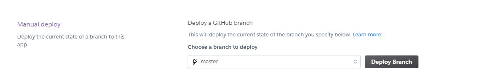

# Football memories site
Football memories is a website that allows users to add/edit/delete/view football memories for given tournaments. 
It also allows users to rate and comment on football memories
- There are two types of users, and I have set up accounts for both
    - An admin user account has been set up with username/password of administrator/Password123
    - A regular user account has been set up with username/password of testuser/Password123
<br>

View the live site [here](https://ci-ms3-footballmemories.herokuapp.com/)
<br><br>


# Table of Contents
- [Project Overview](#project-overview)
- [UX](#ux)
  * [Strategy](#strategy)
    + [Primary Goal](#primary-goal)
  * [Structure](#structure)
    + [Code Structure.](#code-structure)
    + [Database](#database)
      - [Conceptual database model](#conceptual-database-model)
      - [Physical database model](#physical-database-model)
      - [Mongo DB database information](#mongo-db-database-information)
      - [Users](#users)
      - [Tournaments](#tournaments)
      - [Memories](#memories)
      - [Comments](#comments)
      - [Ratings](#ratings)
    + [Amazon Web Services S3 bucket](#amazon-web-services-s3-bucket)
    + [Website pages](#website-pages)
  * [Scope](#scope)
    + [User Stories Potential or Existing Customer](#user-stories-potential-or-existing-customer)
    + [User Stories Website Owner](#user-stories-website-owner)
  * [Skeleton](#skeleton)
    + [Wireframes](#wireframes)
  * [Surface](#surface)
    + [Color Palette](#color-palette)
    + [Typography](#typography)
- [Features](#features)
  * [Existing Features](#existing-features)
    + [Feature 1 Navigation Bar](#feature-1-navigation-bar)
      - [Description](#description)
      - [Nav Bar Logged Out](#nav-bar-logged-out)
      - [Nav Bar Logged Out Mobile](#nav-bar-logged-out-mobile)
      - [Nav Bar Logged In](#nav-bar-logged-in)
      - [Nav Bar Logged In Mobile](#nav-bar-logged-in-mobile)
      - [User Stories](#user-stories)
    + [Feature 2 Footer](#feature-2-footer)
      - [Description](#description-1)
      - [Footer desktop](#footer-desktop)
      - [Footer Mobile](#footer-mobile)
      - [User Stories](#user-stories-1)
    + [Feature 3 Landing/Home page](#feature-3-landing-home-page)
      - [Description](#description-2)
        * [Hero image](#hero-image)
      - [User Stories](#user-stories-2)
    + [Feature 4 Login/Register/Logout administration](#feature-4-login-register-logout-administration)
      - [Description](#description-3)
      - [User Stories](#user-stories-3)
    + [Feature 5 Memories, Memory, Add/Edit/Delete Memory](#feature-5-memories--memory--add-edit-delete-memory)
      - [Description](#description-4)
      - [User Stories](#user-stories-4)
    + [Feature 6 Tournaments](#feature-6-tournaments)
      - [Description](#description-5)
      - [User Stories](#user-stories-5)
    + [Feature 7 Dashboard](#feature-7-dashboard)
      - [Description](#description-6)
      - [User Stories](#user-stories-6)
    + [Feature 8 Profile](#feature-8-profile)
      - [Description](#description-7)
      - [Profile/Edit Profile](#profile-edit-profile)
      - [User Stories](#user-stories-7)
  * [Features Left to Implement](#features-left-to-implement)
- [Technologies Used](#technologies-used)
  * [Languages](#languages)
  * [Libraries and other resources](#libraries-and-other-resources)
- [Testing](#testing)
- [APIs](#apis)
  * [Google Maps API](#google-maps-api)
  * [Email JS](#email-js)
- [Deployment](#deployment)
  * [Amazon WebServices](#amazon-webservices)
  * [Mongo Database](#mongo-database)
  * [Local Deployment](#local-deployment)
  * [Heroku](#heroku)
- [Credits](#credits)
- [Content](#content)
- [Media](#media)
- [Acknowledgements](#acknowledgements)

<small><i><a href='http://ecotrust-canada.github.io/markdown-toc/'>Table of contents generated with markdown-toc</a></i></small>

# Project Overview
- This project is a website that allows users to add/edit/delete football memories for given tournament for submission as milestone project 3 as part of the Code Institute - Diploma in Software Development (Full stack) course.
- The website is deployed using Heroku pages at the following url: [Football Memories]((https://ci-ms3-footballmemories.herokuapp.com/)
- The repository on GitHub that contains the website source code and assets is available at the following url: [Code Repository](https://github.com/pmeeny/CI-MS3-FootballMemories)
- The website was built with a responsive look and feel for desktop, tablet and mobile devices

# UX
## Strategy
### Primary Goal
The primary goal of the website from the site 
owners perspective is as follows:
- To create/edit/delete tournaments so users can add a memory to a tournament(name and image)
- To allow users add their football memories(name, image, tournament, description, date, stadium)
- To allow users modify their football memories(name, image, tournament, description, date, stadium)
- To allow users delete their football memories
- To allow users view their memories and other users memories
- To allow users comment on a memory
- To allow users rate a memory with a score from 1-5
- To view statistics on the usage of the site

The primary goal of the website from a site users perspective is as follows:
- To allow users add their football memories(name, image, tournament, description, date, stadium)
- To allow users modify their football memories(name, image, tournament, description, date, stadium)
- To allow users delete their football memories
- To view their memories and other users memories
- To comment on a memory and view comments
- To rate a memory with a score from 1-5 and view ratings of a memory

## Structure
### Code Structure.
- My project is built using a Blueprints structure
- A blueprint in Flask is an object to structure a Flask application into subsets. This helped in organizing code and separating functionality.
- I found the following video and links invaluable to structure my project accordingly
    - https://www.youtube.com/watch?v=Wfx4YBzg16s&list=PL-osiE80TeTs4UjLw5MM6OjgkjFeUxCYH&index=11 
    - https://github.com/CoreyMSchafer/code_snippets/tree/master/Python/Flask_Blog 
- The project is structured as follows
    - Administration: Contains a flask route for administration code, for example a dashboard
    - Authentication: Contains a flask route for authentication for example login, register
    - Errors: Contains a flask route for error pages for example 404
    - Memories: Contains a flask route for memory code, adding, editing etc
    - Static
      - css (Project style css)
      - Images (Project and readme images)
      - Js (Project javascript structured into individual files)
    - Templates
      - Html templates to match the routes for Administration, Authentication, Errors, Memories, Tournaments and a base.html file
    - Tournaments: Contains a flask route for tournament code, adding, editing etc 
    - Util: Utilities, common code for example aws code for writing to an aws s3 bucket
    
### Database
- The website is a data-centric one with html, javascript, css used with the boostrap framework as a frontend
- The backend consists of Python, flask and jinja templates with a database of a mongodb open-source document-oriented database


#### Conceptual database model
The first step in the database design was to create a conceptual data model. The helped me understand the design at a conceptual level while enabling me to understand the required collections in the database


#### Physical database model
From the conceptual database model I created the physical database model. This model contains all fields stored in the database collections with their data type and mimics the structure of what is actually stored in the mongo database(mongodb)


#### Mongo DB database information
- One production database(football_memories_prod) was created to store site information, it contains five collections described below
1. users - to store registered user information
2. tournaments - to store tournament information added by an admin user
3. memories - to store memory information added by an admin/regular user
4. comments - to store comment information for a memory added by an admin/regular user
5. ratings - to store rating information for a memory added by an admin/regular user

#### Users
- The users' collection is used to store user information when they register.
- The fields stored in the collection are users username(String), password(String), first_name(String), last_name(String), favourite_team(String) and country(String) with a unique identifier(primary key) , "_id"(Object Id)
- The users' password is encrypted using a generate_password_hash from a werkzeug.security Python library.


#### Tournaments
- The tournaments that memories are added to are added by an admin user.
- The fields stored in the collection are the tournament name(String) and tournament image(String) with a unique identifier(primary key)  automatically assigned by the mongodb, "_id"(Object Id) primary key


#### Memories
- Memories are added by regular and admin users
- The fields stored in the collection are the memory_image(String), tournament name(String), memory name(String), memory_description(String), memory_date(String), memory_stadium(String), memory_view_count(Int32), memory_created_by(username) with a unique identifier(primary key) automatically assigned by the mongodb, "_id"(Object Id)
- When a user adds a memory, it stores the tournament name(from the tournaments added in the tournament table) and a memory_created_by(take from the User tables username field of the user who added the memory) to create a link between the two collections
- The memory_name and memory_description have search indexes setup for searching functionality


#### Comments
- Comments are added to a memory by a regular or admin user
- The fields stored in the collection are the memory_id(String), comment_text(String), comment_date(String), comment_created_by(String) with a unique identifier(primary key) automatically assigned by the mongodb, "_id"(Object Id)
- When a user adds a comment, it stores the memory_id(from the memories table) in the collection and the comment_created_by field, storing the username(from the User table) who added the comment to create a link between the two collections


#### Ratings
- Ratings are added to a memory by a regular or admin user
- The fields stored in the collection are the rating value(Int32), the rating_created_by(String) with a unique identifier(primary key)  automatically assigned by the mongodb, "_id"(Object Id)
- When a user adds a rating, the rating_created_by field populated with the users' username(from the User table) to create a link between the two collections


### Amazon Web Services S3 bucket
While mongodb stores the majority of the users' data in the database, any images added
by a regular user or admin user when adding a new tournament or memory is stored in an 
Amazon Web services(AWS) S3(storage) bucket. I made this choice for performance reasons(https://aws.amazon.com/s3/faqs/)
and to challenge myself to learn how to integrate the site with AWS.
Here are the steps I took for the integration
1. I created an account with AWS, and created an S3 bucket named "ci-ms3-football-memories"

2. I created a user in AWS IAM, and gave the user the AmazonS3FullAccess permission   
3. I then gave the bucket policy the necessary permissions to allow my application to access 
the S3 bucket

4. I imported the Boto3 python library (https://boto3.amazonaws.com/) in the util.py file
I made a design decision to have an util.py in an util flask route python file that would be used to store common code
that could be used by multiple routes
5. The relevant s3 variables for the bucket name, url and access/secret keys are defined at the top of the util.py file
   <code>
   s3_bucket_name = "ci-ms3-football-memories"
s3_bucket_url = "https://ci-ms3-football-memories.s3.eu-west-1.amazonaws.com/"
client = boto3.client('s3', 
                aws_access_key_id=os.environ.get("AWS_ACCESS_KEY_ID"),
                aws_secret_access_key=os.environ.get("AWS_SECRET_ACCESS_KEY"))
   </code>
6. A single function was written named storeImageAWSS3Bucket that takes one parameter, the filename to store
7. This single function is used by the tournament and memories routes to store the images in the S3 bucket
8. This function stores a file in an AWS S3 bucket using boto3. The filename is in the form timestamp + name of file added by the user
The timestamp ensures uniqueness for every file added to the s3 bucket allowing users to use the same filename if desired.
<code>
   image_file = secure_filename(image.filename)
    image_to_upload = timestamp + image_file
</code>
9. The boto3 put_object method is used to store the image taking two parameters, the file name and actual file
<code>
   s3.Bucket(s3_bucket_name).put_object(Key=image_to_upload, Body=image)
</code>
10. An image url is returned, and it is the image url that is stored in the mongodb for the relevant tournament or memory
<code>
image_url = s3_bucket_url + image_to_upload
</code>


   
### Website pages
I have structured the website into 19 pages, each with clear, concise structure, information and purpose. I use the Bootstrap grid system throughout, which gave a consistent structure and responsive design "out of the box"
1. Home/Landing Page: This is the landing page, and the first page the user encounters when they access the site, before they log in/register
2. Register: This page allows the user to register an account to use the site
3. Login: This page allows the user to login to the site
4. Terms and Conditions: This page displays the sites terms and conditions
5. Privacy Policy: This page displays the sites' privacy policy
6. Memories: This is the first page the user sees when the login/register, it displays all the football memories that have been added
7. Add Memory: This page allows the user to add a football memory
8. Edit Memory: This page allows a user to edit a memory they have created
9. Delete Memory: This button allows a user to delete a memory they have created
10. Profile: This page displays user information and allows the user to update their profile
11. Dashboard: This page displays statistics about the number of users, tournaments memories, comments
12. Tournaments: This page displays the tournaments that have been created by the admin user. An admin user can add/edit or delete a tournament
13. Add Tournament: This page allows an admin user to add a football tournament
14. Edit Tournament: This page allows an admin user to edit a football tournament
15. Delete Tournament: This button allows an admin user to edit a football tournament as long as there are no memories associated 
    and a minimum of one tournament in the tournament collection
16. Logout: This link allows the user to logout of the site
17. Newsletter: The user can enter their email address in the site footer and subscribe to a mailing list
18. 404: The 404 error page is displayed if the user enters an incorrect url when accessing the site.
19. 500: The 500 error page is displayed if the user encounters an error on the site

## Scope
There is overlap in terms of user stories for the two types of users, and they are described below
### User Stories Potential or Existing Customer
The user stories for the website user "regular user" (a potential or existing customer) are described as follows: 
- User Story 1.1: As a regular user the navigation bar is displayed with a logo on all pages for easy navigation, with a burger menu on mobile devices
- User Story 1.2: As a regular user the navigation item selected is highlighted
- User Story 1.3: As a regular user, when logged out, the home/landing page is the default page and there are three options with a logo, Home, Login, Register displayed
- User Story 1.4: As a regular user, when logged in, the memories page is the default page and there are six options with a logo: Memories, Add Memory, Tournaments, Profile, Dashboard, Logout
- User Story 2.1: As a regular user I can view the footers social icons(Twitter, facebook, instagram, pinterest, snapchat) and the relevant website opens in a new tab when clicked
- User Story 2.2: As a regular user I can view the websites terms and condition page by clicking on the link in the footer
- User Story 2.3: As a regular user I can view the websites' privacy policy page by clicking on the link in the footer
- User Story 2.4: As a regular user I can sign up to the football memories newsletter by entering my email and clicking SignUp. The email address entered will receive an email
- User Story 3.1: As a regular user I can view a hero image with login and register buttons on the home/landing page
- User Story 3.2: As a regular  user I can view the last three memories added on the website, with memory name, memory image
and tournament
- User Story 4.1: As a regular user I can register for an account by providing my username, password, confirm password, first name, last name, favourite team and country, and I will be brought to the memories page. All fields must be provided
- User Story 4.2: As a regular user my username must be a minimum of 6 characters, and contain at least one lowercase letter, with no special characters
- User Story 4.3: As a regular user my password must be a minimum of 6 characters and contain at least one number, one lowercase and one uppercase letter, with no special characters
- User Story 4.4: As a regular user my password must match my confirm password
- User Story 4.5: As a regular user I can log in to my account by providing my username and password and clicking Login and I will be navigated to the memories page. A username and password must be provided. If the username and/or password entered is incorrectly a relevant message will be displayed
- User Story 4.6: As a regular user, when I am logged into the site, and I click Logout I am successfully logged out of the site, and brought to the home/landing page, and the navigation bar is updated with three options with a logo, Home, Login, Register
- User Story 4.7: As a regular user, when I am logged into the site, and I click the back button I am automatically redirected to the home/landing page, and the navigation bar is updated with three options with a logo, Home, Login, Register
- User Story 5.1: Add Memory - As a regular user I can add a memory by selecting a tournament, uploading a memory image, entering a memory name, description, date and stadium. All fields are mandatory
- User Story 5.2: Add Memory - As a regular user the memory image I upload must be png or jpg format
- User Story 5.3: Edit  Memory - As a regular user I can edit a memory by uploading a memory image, updating the memory name, description, date and stadium. All fields are mandatory
- User Story 5.4: Delete Memory - As a regular user I can delete a memory I created by confirming I want to delete
- User Story 5.6: View Memory - As a regular user I can view a memory by clicking on a memory
- User Story 5.7: View Memory - As a regular user I can view the memory image, stadium in a Google map, average rating, view account, memory name, description, tournament name,  date, view count, uploaded by information and all comments for the memory, paginated if there are more than 3 comments
- User Story 5.8: View Memory - As a regular user the view count increases when the user clicks on a memory or refreshes the memory page
- User Story 5.9: View Memory - As a regular user I can add a comment to a memory
- User Story 5.10: View Memory - As a regular user I can add a comment to a rating to a memory, and the average rating is updated accordingly
- User Story 5.11: My Memories- As a regular user I can filter on memories I have created, and the page will be paginated if there are more than 3 memories
- User Story 5.12: All Memories - As a regular user I can filter on memories I have created, and the page will be paginated if there are more than 3 memories
- User Story 5.13: Search - As a regular user I can search on text for the memory name and memory description, and the memories page will be updated with those filtered memories 
User Story 6.1: As a regular user I can view a list of tournaments with the tournament name and tournament image displayed, and pagination is displayed if there are more than 3 tournaments
- User Story 7.1: As a regular user I can view a dashboard to see the number of users, number of tournaments, number of memories, number of ratings and number of comments added on the site
- User Story 8.1: As a regular user I can view my profile details: Username, First Name, Last Name, Favourite Team and Country. The country is selected from a dropdown of countries
- User Story 8.2: As a regular user I can update my profile password, but the confirm password entered must match with the password. The password must be 8-20 characters long, contain letters and numbers, and must not contain spaces, special characters, or emoji.
- User Story 8.3: As a regular user I can update my profile details: First Name, Last Name, Favourite Team and Country
- User Story 8.4: As a regular user the following fields are mandatory: Username, First Name, Last Name, Favourite Team and Country
- User Story 8.5: As a regular user I can delete my account. This will delete any memories I have added(including their associated comments and ratings) and will also delete any comments or ratings the regular user has added on others users memories. The user will be asked to confirm the delete account action, and will be brought to the homepage after their account is successfully deleted.

### User Stories Website Owner
The user stories for the website owner(admin user) are described as follows: 
There is a lot of overlap between the two user types, the admin user however has more administrative rights throughout
- User Story 1.1: As an admin user the navigation bar is displayed with a logo on all pages for easy navigation, with a burger menu on mobile devices
- User Story 1.2: As an admin user the navigation item selected is highlighted
- User Story 1.3: As an admin user, when logged out, the home/landing page is the default page and there are three options with a logo, Home, Login, Register displayed
- User Story 1.4: As an admin user, when logged in, the memories page is the default page and there are six options with a logo: Memories, Add Memory, Tournaments, Profile, Dashboard, Logout
- User Story 2.1: As an admin user I can view the footers social icons(Twitter, facebook, instagram, pinterest, snapchat) and the relevant website opens in a new tab when clicked
- User Story 2.2: As an admin user I can view the websites terms and condition page by clicking on the link in the footer
- User Story 2.3: As an admin user I can view the websites' privacy policy page by clicking on the link in the footer
- User Story 2.4: As an admin user I can sign up to the football memories newsletter by entering my email and clicking SignUp. The email address entered will receive an email
- User Story 3.1: As an admin user I can view a hero image with login and register buttons on the home/landing page
- User Story 3.2: As an admin user I can view the last three memories added on the website, with memory name, memory image
and tournament
- User Story 4.5: As an admin user I can log in to my account by providing my username and password and clicking Login and I will be navigated to the my memories page. A username and password must be provided. If the username and/or password entered is incorrectly a relevant message will be displayed
- User Story 4.6: As an admin user, when I am logged into the site, and I click Logout I am successfully logged out of the site, and brought to the home/landing page, and the navigation bar is updated with three options with a logo, Home, Login, Register
- User Story 4.7: As an admin user, when I am logged into the site, and I click the back button I am automatically redirected to the home/landing page, and the navigation bar is updated with three options with a logo, Home, Login, Register
- User Story 5.1: Add Memory - As an admin user I can add a memory by selecting a tournament, uploading a memory image, entering a memory name, description, date and stadium. All fields are mandatory
- User Story 5.2: Add Memory - As an admin user the memory image I upload must be png or jpg format
- User Story 5.3: Edit  Memory - As an admin user I can edit a memory by uploading a memory image, updating the memory name, description, date and stadium. All fields are mandatory
- User Story 5.5: Delete Memory - As an admin user I can delete a memory, created by any user or a memory I have created
- User Story 5.6: View Memory - As an admin user I can view a memory by clicking on a memory
- User Story 5.7: View Memory - As an admin user I can view the memory image, stadium in a Google map, average rating, view account, memory name, description, tournament name,  date, view count, uploaded by information and all comments for the memory, paginated if there are more than 3 comments
- User Story 5.8: View Memory - As an admin user the view count increases when the user clicks on a memory or refreshes the memory page
- User Story 5.9: View Memory - As an admin user I can add a comment to a memory
- User Story 5.10: View Memory - As an admin user I can add a comment to a rating to a memory, and the average rating is updated accordingly
- User Story 5.11: My Memories- As an admin use user I can filter on memories I have created, and the page will be paginated if there are more than 3 memories
- User Story 5.12: All Memories - As an admin use user I can filter on memories I have created, and the page will be paginated if there are more than 3 memories
- User Story 5.13: Search - As an admin user I can search on text for the memory name and memory description, and the memories page will be updated with those filtered memories 
- User Story 6.2: As an admin user I can view list of tournaments with the tournament name and tournament image displayed, and pagination is displayed if there are more than 3 tournaments. On the tournaments page I can also view an Add Tournament, Edit Tournament and Delete Tournament buttons
- User Story 6.3: As an admin user I can add a new tournament with a tournament name and tournament image. Both fields are mandatory and a message is displayed accordingly. The tournament information is added in the mongo database and the tournament image is stored in an AWS S3 bucket 
- User Story 6.4: As an admin user I can edit an existing tournament with a tournament name and tournament image. Both fields are mandatory and a message is displayed accordingly. The tournament information is updated in the mongo database and the tournament image is stored in an AWS S3 bucket
- User Story 6.5: As an admin user I can delete an existing tournament, once I have confirmed that it is ok to delete the tournament. The tournament information is deleted from the mongo database
- User Story 6.6: As an admin user if a tournament has memories associated with it, the tournament cannot be deleted and a message is displayed
- User Story 6.7: As an admin user if there is only one tournament in website, it cannot be deleted, a minimum of one tournament is required
- User Story 7.1: As an admin user I can view a dashboard to see the number of users, number of tournaments, number of memories, number of ratings and number of comments added on the site
- User Story 8.1: As an admin user I can view my profile details: Username, First Name, Last Name, Favourite Team and Country. The country is selected from a dropdown of countries
- User Story 8.2: As an admin user I can update my profile password, but the confirm password entered must match with the password. The password must be 8-20 characters long, contain letters and numbers, and must not contain spaces, special characters, or emoji.
- User Story 8.3: As an admin user I can update my profile details: First Name, Last Name, Favourite Team and Country
- User Story 8.4: As an admin user the following fields are mandatory: Username, First Name, Last Name, Favourite Team and Country

## Skeleton
### Wireframes
Each wireframe image below contains three sub images, one for desktop, tablet and mobile

Page | Wireframe | 
------------ | ------------- 
index | [Desktop/Tablet/Mobile](football_memories/static/images/wireframes/index.png)
register | [Desktop/Tablet/Mobile](football_memories/static/images/wireframes/register.png)
login | [Desktop/Tablet/Mobile](football_memories/static/images/wireframes/login.png)
memories | [Desktop/Tablet/Mobile](football_memories/static/images/wireframes/memories.png)
memory | [Desktop/Tablet/Mobile](football_memories/static/images/wireframes/memory.png)
add_memory/edit_memory | [Desktop/Tablet/Mobile](football_memories/static/images/wireframes/add_edit_memory.png)
delete_memory | [Desktop/Tablet/Mobile](football_memories/static/images/wireframes/delete_memory.png)
tournaments | [Desktop/Tablet/Mobile](football_memories/static/images/wireframes/tournaments.png)
add_tournament/edit_tournament | [Desktop/Tablet/Mobile](football_memories/static/images/wireframes/add_edit_tournanent.png)
delete_tournament | [Desktop/Tablet/Mobile](football_memories/static/images/wireframes/delete_tournament.png)
profile | [Desktop/Tablet/Mobile](football_memories/static/images/wireframes/profile.png)
dashboard | [Desktop/Tablet/Mobile](football_memories/static/images/wireframes/dashboard.png)
terms_and_conditions | [Desktop/Tablet/Mobile](football_memories/static/images/wireframes/terms_and_conditions.png)
privacy_policy | [Desktop/Tablet/Mobile](football_memories/static/images/wireframes/privacy_policy.png)


## Surface
### Color Palette
I have gone for a simple and minimal design for the website, with predominately green, black and white font colours over a large hero image on all pages
There are five colours in the color palette
- 264653 - Dark green colour for some button and text colours
- 006400 - Light green colour for some button and text colours
- 000000 - Black color for some text
- F8F9FA - Light grey colour for the header and footer and panel backgrounds
- DC3545 - Red colour for some buttons, cancel and delete buttons

I feel the colours complement each other very well, and I choose those colours after testing a number of palettes while making sure the colour palette met accessibility standards.


### Typography
The Poppins font is the main font used throughout the whole website with Sans Serif as the fallback font in case for any reason the Poppins font cannot be imported into the website correctly. This font is from the Google fonts library.


# Features
The website has seven distinct features, and they are described below
## Existing Features
### Feature 1 Navigation Bar
#### Description
- This is the navigation bar of the website, and is displayed on all pages. The navigation bar is a bootstrap component, and is a responsive component. It becomes a burger menu on tablet and mobile devices.
- When the user is not logged in, there are three options with a logo, Home, Login, Register
- When the user is logged in, there are six options with a logo: Memories, Add Memory, Tournaments, Profile, Dashboard, Logout

- Clicking on the Logout button logs the user out of the site, and their session is ended. If they click back they are automatically re-sent back to the home/landing page
- The following code is a check on the relevant functions in every flask route on the website
<code>
    if 'user' not in session:
        return redirect(url_for("administration.home"))
</code><br>

<br>

#### Nav Bar Logged Out

#### Nav Bar Logged Out Mobile

#### Nav Bar Logged In

#### Nav Bar Logged In Mobile


#### User Stories
- User Story 1.1: As an admin/regular user the navigation bar is displayed with a logo on all pages for easy navigation, with a burger menu on mobile devices
- User Story 1.2: As an admin/regular user the navigation item selected is highlighted
- User Story 1.3: As an admin/regular user, when logged out, the home/landing page is the default page and there are three options with a logo, Home, Login, Register displayed
- User Story 1.4: As an admin/regular user, when logged in, the memories page is the default page and there are six options with a logo: Memories, Add Memory, Tournaments, Profile, Dashboard, Logout

### Feature 2 Footer
#### Description
The footer of the website is displayed on all pages. It consists of three main sections

1. Logo with text and social media links
2. Terms and Conditions and Privacy Policy links
3. Newsletter signup

The terms and conditions and privacy policy contain the relevant infromation, it is test data for the purpose of having these pages on the website
When the user enters their email address and clicks Signup the div is updated with a message


#### Footer desktop


#### Footer Mobile


#### User Stories
- User Story 2.1: As an admin/regular user I can view the footers social icons(Twitter, facebook, instagram, pinterest, snapchat) and the relevant website opens in a new tab when clicked
- User Story 2.2: As an admin/regular user I can view the websites terms and condition page by clicking on the link in the footer
- User Story 2.3: As an admin/regular user I can view the websites' privacy policy page by clicking on the link in the footer
- User Story 2.4: As an admin/regular user I can sign up to the football memories newsletter by entering my email and clicking SignUp. The email address entered will receive an email


### Feature 3 Landing/Home page
#### Description
The landing/home page is displayed when the user first accessing the site, and when they log out. It displays a hero image with Login/Register buttons

##### Hero image


Below the hero image are the last three memories added by users. The following code is used to query the mongodb in the administration route python file
<code>
three_latest_memories = list(mongo.db.memories.find().
                                 sort("_id", -1).limit(3))
</code><br>


#### User Stories
- User Story 3.1: As a regular user/admin user I can view a hero image with login and register buttons on the home/landing page
- User Story 3.2: As a regular user/admin user I can view the last three memories added on the website, with memory name, memory image
and tournament

### Feature 4 Login/Register/Logout administration
#### Description
- The user can register for an account on the website by entering their username, password, confirming their password, first name, last name, favourite team, country.
- All fields are mandatory and a relevant message will be displayed and the username must be unique otherwise a message will be displayed to the user
- The username must be a minimum of 6 characters and contain at least one lowercase letter, with no special characters
- The password must be a minimum of 6 characters and contain least one number, one lowercase and one uppercase letter, with no special characters
- The password must match the confirm password
- The country is selected from a dropdown list of countries
- Note: I have limited the functionality so that only regular users and not admin users can register on the site

- The user can log in into their account by clicking on the Login button on the landing page or clicking the Login link in the navigation bar. They must enter a valid username and password otherwise a relevant message will be displayed.


#### User Stories
- User Story 4.1: As a regular user I can register for an account by providing my username, password, confirm password, first name, last name, favourite team and country, and I will be navigated to the memories page. All fields must be provided
- User Story 4.2: As a regular user my username must be a minimum of 6 characters, and contain at least one lowercase letter, with no special characters
- User Story 4.3: As a regular user my password must be a minimum of 6 characters and contain at least one number, one lowercase and one uppercase letter, with no special characters
- User Story 4.4: As a regular user my password must match my confirm password
- User Story 4.5: As a regular user/admin user I can log in to my account by providing my username and password and clicking Login and I will be navigated to the memories page. A username and password must be provided. If the username and/or password entered is incorrectly a relevant message will be displayed
- User Story 4.6: As an admin/regular user, when I am logged into the site, and I click Logout I am successfully logged out of the site, and brought to the home/landing page, and the navigation bar is updated with three options with a logo, Home, Login, Register
- User Story 4.7: As an admin/regular user, when I am logged into the site, and I click the back button I am automatically redirected to the home/landing page, and the navigation bar is updated with three options with a logo, Home, Login, Register


### Feature 5 Memories, Memory, Add/Edit/Delete Memory
#### Description
- A user can add a memory by clicking on the Add Memory link and providing the following information
    - Tournament Name, a dropdown appears with a list of tournament
    - Memory Image, an image upload that the user can upload an image. The file types allowed are jpg and png, and a message is displayed if the user tried to add a memory with an image type not matching jpg or png
    - Memory Name, a text field,. where the user can enter a memory name
    - Memory Description, a textarea, where the user can enter a memory description, date(calendar date in the form dd/mm/yyyy) and stadium
    - All fields are mandatory
    Clicking cancel will bring the user back to the Memories page, clicking Add Memory will save the changes and create the memory
    
- A user can edit an existing memory by clicking on the Edit Memory button on a memory(My memories) and providing the following information
    - Tournament Name, the selected tournament is displayed
    - Memory Image, an image upload that the user can upload an image. The file types allowed are jpg and png, and a message is displayed if the user tried to add a memory with an image type not matching jpg or png. For security purposes a new image must be uploaded
    - Memory Name, a text field, where the user can update a memory name
    - Memory Description, a textarea, where the user can update a memory description, date(calendar date in the form dd/mm/yyyy) and stadium
    - All fields are mandatory
    - Clicking cancel will bring the user back to the Memories page, clicking Save Changes will save the changes and update the memory
    
- A user can delete a memory they have created, and admin user can delete any memory
    - A pop up will appear confirming that the user wishes to delete a memory, all comments, ratings will also be deleted for the deleted memory
    
- A user can view all memories or filter on memories they have created on the Memories page. When the login/register they are navigated to the All Memories page, but when they add/edit/delete a memory, they are navigated to their memories page


- Pagination will be displayed if there are more than 3 memories

- A user can search memories based on text on the memory name and description, the user can also reset the search. The search is not case sensitive

- A user can click on a memory in the memories page to view detailed infroamtion about the memory
    - They can view a larger image of the memory
    - They can view a google map of the stadium that was entered for the memory
    - They can view the memory name, memory description, tournament name, stadium, date
    - They can view the view count of the image, and this value increments when the memory is viewed
    - They can view the avergae rating for a memory(total of ratings/number of ratings)
    - They can submit a rating for the memory, with a value of 1-5
    - They can view all comments for a memory, and the page is paginated if there are more than 3 comments
    - They can add a comment, and the comment is displayed with the comment, added by and date
    

#### User Stories
- User Story 5.1: Add Memory - As a regular user/admin user I can add a memory by selecting a tournament, uploading a memory image, entering a memory name, description, date and stadium. All fields are mandatory
- User Story 5.2: Add Memory - As a regular user/admin user the memory image I upload must be png or jpg format
- User Story 5.2: Edit  Memory - As a regular user/admin user I can edit a memory by uploading a memory image, updating the memory name, description, date and stadium. All fields are mandatory
- User Story 5.3: Delete Memory - As a regular user I can delete a memory I created by confirming I want to delete
- User Story 5.3: Delete Memory - As an admin user I can delete a memory, created by any user
- User Story 5.4: View Memory - As a regular user/admin user I can view a memory by clicking on a memory
- User Story 5.5: View Memory - As a regular user/admin user I can view the memory image, stadium in a Google map, average rating, view account, memory name, description, tournament name,  date, view count, uploaded by information and all comments for the memory, paginated if there are more than 3 comments
- User Story 5.5: View Memory - As a regular user/admin user the view count increases when the user clicks on a memory or refreshes the memory page
- User Story 5.6: View Memory - As a regular user/admin user I can add a comment to a memory
- User Story 5.7: View Memory - As a regular user/admin user I can add a comment to a rating to a memory, and the average rating is updated accordingly
- User Story 5.8: My Memories- As a regular user/admin user I can filter on memories I have created, and the page will be paginated if there are more than 3 memories
- User Story 5.9: All Memories - As a regular user/admin user I can filter on memories I have created, and the page will be paginated if there are more than 3 memories
- User Story 5.10: Search - As a regular user/admin I can search on text for the memory name and memory description, and the memories page will be updated with those filtered memories 

### Feature 6 Tournaments
#### Description
- A regular user can view the tournaments they can add memories to. Three tournaments are displays per page(tournament name, tournament image), and pagination is displayed if there are more than three tournaments in the mongodb database


- An admin user can add/edit and delete a tournament

- Adding a tournament requires a tournament name and tournament image field to be filled in. The file types allowed are jpg and png, and a message is displayed if the admin user tries to add a tournament with an image type not matching jpg or png
    
- Editing a tournament requires a tournament name and tournament image field to be filled in. The file types allowed are jpg and png, and a message is displayed if the admin user tries to add a tournament with an image type not matching jpg or png
    
- A tournament can be deleted

    - If it has no memories associated
    - There is a minimum of one tournamnent in the database after deletion
    

#### User Stories
- User Story 6.1: As a regular user/admin user I can view a list of tournaments created with the tournament name and tournament image displayed
- User Story 6.2: As a regular user/admin user the list of tournaments is displayed with three per page, and pagination is displayed if there are more than 3 tournaments
- User Story 6.3: As an admin user I can add a new tournament with a tournament name and tournament image. Both fields are mandatory and a message is displayed accordingly. The tournament information is added in the mongo database and the tournament image is stored in an AWS S3 bucket 
- User Story 6.4: As an admin user I can edit an existing tournament with a tournament name and tournament image. Both fields are mandatory and a message is displayed accordingly. The tournament information is updated in the mongo database and the tournament image is stored in an AWS S3 bucket
- User Story 6.5: As an admin user I can delete an existing tournament, once I have confirmed that it is ok to delete the tournament. The tournament information is deleted from the mongo database
- User Story 6.6: As an admin user if a tournament has memories associated with it, the tournament cannot be deleted and a message is displayed
- User Story 6.7: As an admin user if there is only one tournament in website, it cannot be deleted, a minimum of one tournament is required

### Feature 7 Dashboard
#### Description
The dashboard page displays the results of 5 queries against the mongo db for the number of users, number of tournaments, number of memories, number of ratings and number of comments added on the site


<code>number_of_users = mongo.db.users.count() </code> <br>
 <code> number_of_tournaments = mongo.db.tournaments.count() </code> <br>
 <code>     number_of_memories = mongo.db.memories.count() </code> <br>
 <code>     number_of_comments = mongo.db.comments.count() </code> <br>
 <code>     number_of_ratings = mongo.db.ratings.count() </code>
   

#### User Stories
- User Story 7.1: As a regular user/admin user I can view a dashboard to see the number of users, number of tournaments, number of memories, number of ratings and number of comments added on the site


### Feature 8 Profile
#### Description
- A user can view or edit their profile details. Their username is displayed, but it is an un-editable field. When the user clicks save changes they are brought back to the Profile page with the relevant updates made
- A user cannot update their username, the field is read only on the profile page
- All fields are mandatory, similar to the registration page

#### Profile/Edit Profile


#### User Stories
- User Story 8.1: As a regular user/admin user I can view my profile details: Username, First Name, Last Name, Favourite Team and Country. The country is selected from a dropdown of countries
- User Story 8.2: As a regular user/admin user I can update my profile password, but the confirm password entered must match with the password. The password must be 8-20 characters long, contain letters and numbers, and must not contain spaces, special characters, or emoji.
- User Story 8.3: As a regular user/admin user I can update my profile details: First Name, Last Name, Favourite Team and Country
- User Story 8.4: As a regular user/admin user the following fields are mandatory: Username, First Name, Last Name, Favourite Team and Country
- User Story 8.5: As a regular user I can delete my account. This will delete any memories I have added(including their associated comments and ratings) and will also delete any comments or ratings the regular user has added on others users memories. The user will be asked to confirm the delete account action, and will be brought to the homepage after their account is successfully deleted.


##  Features Left to Implement
- I am content with what was implemented. The site is a feature rich site using a number of linked namespaces in a mongodb collection.
- However, here are some additional "nice to have" features that could be added to the site

Number | Feature  
 ------------ | ------- |
1 | Social sharing of a memory on facebook, twitter  |
2 | The image type(jpg, png) is read and the memory displays a different helper image based on it
3 | Tags functionality and search by tags
4 | Enhance reporting/dashboard capabilities, and use a 3pp graph library
5 | User must verify their email address when registering, or 2 factor authentication is implemented
6 | Delete image from aws s3 bucket, when a tournament or memory is deleted. I did attempt to do this but came across permission issues. Despite making numerous changes to the bucket policy I was unable to get the code working. I dont see this as a major issue as there is a lot of space available in the S3 bucket
7 | Continue to make further changes to the blueprint structure, and move all mongodb database related code to its own route

# Technologies Used
## Languages 
- HTML (https://en.wikipedia.org/wiki/HTML)
    - The project uses html to build the relevant pages
- CSS (https://en.wikipedia.org/wiki/CSS)
    - The project uses CSS to style the relevant pages
- Javascript (https://www.javascript.com/)
    - Javascript was used for all scripting on the site
- Python (https://www.python.org/)
    - Python was used for server side coding on the project, a number of libraries were also used: 
        - boto, boto3, botocore, click, dnspython, Flask, flask-paginate, 
        Flask-PyMongo, itsdangerous, Jinja2, jmespath, MarkupSafe, pymongo, s3transfer,Werkzeug
- Jinja (https://jinja.palletsprojects.com/en/3.0.x/)
    - Jinja is a templating engine for Python that is used throughout the project

## Libraries and other resources
- Bootstrap 5.0 (https://getbootstrap.com/docs/5.0)
    - The project uses the bootstrap library for some UI components in the website
- Gitpod (https://gitpod.io/)
    - Gitpod was used as an IDE for the project
- Github (https://github.com/)
    - GitHub was used to store the project code in a repository
- Google Fonts (https://fonts.google.com/)
    - Google font Roboto was used as the website font
- Balsamiq (https://balsamiq.com/)
    - Balsamiq was used to create the website wireframes
- Font Awesome (https://fontawesome.com/)
    - Font awesome was used to provide the relevant fonts/icons for the website
- Lucidchart (http://lucidchart.com)    
    - Lucidchart was used to create the database design diagrams
- JQuery (https://jquery.com)
    - JQuery was used in some javascript files for DOM manipulation
- TinyPNG (https://tinypng.com/)
    - TinyPNG was used to compress images
 - CSS Validation Service (https://jigsaw.w3.org/css-validator/)
    - CSS validation service for validation the css in the project  
- HTML Markup Validation Service (https://validator.w3.org/)   
    - HTML validation service for validation the css in the project  
- Chrome dev tools (https://developers.google.com/web/tools/chrome-devtools)
    - For troubleshooting and debugging of the project code
- Chrome Lighthouse (https://developers.google.com/web/tools/lighthouse)
    - For performance, accessibility, progressive web apps, SEO analysis of the project code
- Responsive Design (http://ami.responsivedesign.is/)
    - Website for generating the responsive image in this README
- JS Fiddle (https://jsfiddle.net/)
    - Used for testing html and css concepts
- GitHub Wiki TOC generator (https://ecotrust-canada.github.io/markdown-toc/)
    - Used for generating a table of contents for this README
- Google Maps api (https://developers.google.com/maps)
    - The Google Maps api is used to display the stadium information on the memory page
- Google maps geocode API (https://developers.google.com/maps/documentation/geocoding/start)
    - The Google Maps geocode api is used to translate the event name returned from the memory stadium name value and translate to a Google Maps location on the memory page
- Gofullpage chrome plugin  (https://chrome.google.com/webstore/detail/gofullpage-full-page-scre)
    - This plugin was used to take full page screenshots for testing images
- Python online interpreter (https://www.programiz.com/python-programming/online-compiler/)
    - For testing python code snippets

# Testing
The testing information and results for this project are documented in [TESTING.md](TESTING.md)

# APIs
The project also uses a number of API's, below are the steps to configure the API in your environment

## Google Maps API
1. Create an account at https://console.developers.google.com
2. Create an API key and set up the account as requested by google, for example billing information
3. Configure 2 APIs, Maps JavaScript API and Geocoding API
3. In the credentials screen, set the web restrictions url referrer to the urls of where the site will be hosted as well as your local development environment
4. In the API restrictions section in the credentials screen, limit to 2 APIs: Maps JavaScript API and Geocoding API
5. In the memory.html file under the footer, update the Google Maps script src to include your API key

## Email JS
1. Create an account at emailjs.com 
2. In the integration screen in the emailjs dashboard, note your userid
3. Create an email service in the Email Services section and note the id
4. Create an email template in the Email templates section and note the id
5. Update the script sendEmail.js, method sendMail with your user id, email service id and email template id

# Deployment
There are a number of applications that need to be configured to run this application locally or on a cloud based service, for example Heroku

## Amazon WebServices
1. Create an account at aws.amazon.com
2. Open the IAM application and create a new user
3. Set the AmazonS3FullAccess for the user and note the users AWS ACCESS and SECRET keys

4. Open the S3 application and create a new bucket. For the purpose of this application the bucket name is ci-ms3-football-memories but this can be updated in the util.py route
5. With security best practices update the public access and policy bucket to enable the user created and the application access to read/write to the S3 bucket. Consult the AWS documentation if required: https://aws.amazon.com/s3/

6. The s3 bucket is now updated to be accessed by your application
7. In the util.py route update the variables s3_bucket_name and s3_bucket_url with the correct information that you have set up, for example:
<code>s3_bucket_name = "ci-ms3-football-memories"</code>
<code>s3_bucket_url = "https://ci-ms3-football-memories.s3.eu-west-1.amazonaws.com/" </code>


## Mongo Database
Mongodb is the database used in the application
1. Create an account at mongodb
2. Create a database cluster
3. Select the cluster, and in the collections section create a database and create 5 collections under the database: memories, comments, ratings, tournaments, users

4. In the database access, create a user and allow the user read/write access. Note the username
5. In the network access tab, allow network access from the ip-address of the application connecting to the database
6. In the Databases section click Connect, and select connect your application
7. Note the MONGO_URI, MONGO_DBNAME and user, these parameters are used when deploying locally(env.py file) and deploying on the likes of heroku(config vars)

## Local Deployment
To run this project locally, you will need to clone the repository
1. Login to GitHub (https://wwww.github.com)
2. Select the repository pmeeny/CI-MS3-FootballMemories
3. Click the Code button and copy the HTTPS url, for example: https://github.com/pmeeny/CI-MS3-FootballMemories.git
4. In your IDE, open a terminal and run the git clone command, for example 

```git clone https://github.com/pmeeny/CI-MS3-FootballMemories.git```

5. The repository will now be cloned in your workspace
6. Create an env.py file, and add in the following code with the relevant key, value pairs, and ensure you enter the correct key values
<code>
import os
os.environ.setdefault("IP", TO BE ADDED BY USER)
os.environ.setdefault("PORT", TO BE ADDED BY USER)
os.environ.setdefault("SECRET_KEY", TO BE ADDED BY USER)
os.environ.setdefault("MONGO_URI", TO BE ADDED BY USER)
os.environ.setdefault("MONGO_DBNAME", TO BE ADDED BY USER)
os.environ.setdefault("AWS_ACCESS_KEY_ID", TO BE ADDED BY USER)
os.environ.setdefault("AWS_SECRET_ACCESS_KEY", TO BE ADDED BY USER)
</code>
7. Install the relevant packages as per the requirements.txt file
8. Start the application by running <code>python3 app.py</code>

## Heroku
To deploy this application to Heroku, run the following steps.
1. In the app.py file, ensure that debug is not enabled, i.e. set to True
2. Create a file called ProcFile in the root directory, and add the line <code>web: python app.py</code> if the file does not already exist
3. Create a requirements.txt file by running the command <code>pip freeze > requirements.txt</code> in your terminal if the file doesn't already exist
5. Both the ProcFile and requirements.txt files should be added to your git repo in the root directory
6. Create an account on heroku.com
7. Create a new application and give it a unique name
8. In the application dashboard, navigate to the deploy section and connect your application to your git repo, by selecting your repo

9. Select the branch for example master and enable automatic deploys if desired. Otherwise, a deployment will be manual
10. The next step is to set the config variables in the Settings section

11. Set key/value pairs for the following keys: AWS_ACCESS_KEY_ID, AWS_SECRET_ACCESS_KEY, IP, MONGO_DBNAME, MONGO_URI, PORT, SECRET_KEY
12. Go to the dashboard and trigger a deployment

13. This will trigger a deployment, once the deployment has been successful click on the "Open App" link to open the app
14. If you encounter any issues accessing the build logs is a good way to troubleshoot the issue

# Credits
- For the memories page, I used some html and css code from https://bootstrapious.com/p/bootstrap-photo-gallery as a basis
for the memories gallery

- For the password validation, I built on examples code described here: 
    - https://www.w3schools.com/howto/howto_js_password_validation.asp
    - https://bootsnipp.com/snippets/67OaM
    - https://learncodeweb.com/bootstrap-framework/registration-form-with-validation-in-bootstrap-4/
    - https://getbootstrap.com/docs/5.0/forms/validation/

- For pagination on the memories, tournament I found the following links useful to implement pagination:  
    - https://gist.github.com/mozillazg/69fb40067ae6d80386e10e105e6803c9
    - https://pythonhosted.org/Flask-paginate/

- For the footer to stick to the bottom of the page, I used code from the following pages:
    -https://stackoverflow.com/questions/4575826/how-to-push-a-footer-to-the-bottom-of-page-when-content-is-short-or-missing#:~:text=Just%20wrap%20your%20.,will%20move%20to%20the%20bottom.
- My project is built using a Blueprints structure, I found the following video and links invaluable to structure my project accordingly
    - https://www.youtube.com/watch?v=Wfx4YBzg16s&list=PL-osiE80TeTs4UjLw5MM6OjgkjFeUxCYH&index=11 
    - https://github.com/CoreyMSchafer/code_snippets/tree/master/Python/Flask_Blog 

- For password validation I re-used some code here:
https://stackoverflow.com/questions/9142527/can-you-require-two-form-fields-to-match-with-html5

- For storing images in an AWS S3 bucket, I found the following links very useful
    - https://www.youtube.com/watch?v=s1Tu0yKmDKU
    - https://stackoverflow.com/questions/44228422/s3-bucket-action-doesnt-apply-to-any-resources
    - https://www.youtube.com/watch?v=7gqvV4tUxmY 

- I found the following resource great for some jquery code used: https://api.jquery.com/replacewith/

- I used html/css code, then tweaked it accordingly for the site footer: https://jsfiddle.net/bootstrapious/c7ash30w/

- For the send-email functionality I used some code from the code institute module from the course

# Content
- Country list (https://www.technicalkeeda.com/html-tutorials/all-countries-drop-down-list-in-html)
    - The country list on the registration page

- Font Awesome (http://fontawesome.com)    
    - The icons used on the site from font awesome

- Fonts (https://fonts.google.com/)    
    - The text font(Poppins) is from Google fonts

- Google Maps (https://www.google.com/maps)
    - The Google Maps api is used to display maps in the memory page

- The terms and conditions and privacy policy page content was copied from https://www.privacypolicies.com/blog/privacy-policy-template/

<br>

# Media
- Pexels (https://www.pexels.com/)
    - The hero image used throughout the site is form Pexels, https://www.pexels.com/photo/aerial-view-of-soccer-field-1171084/ by user https://www.pexels.com/@mike-468229 

- The 42(www.the42.ie), Irish Independant(www.irishindependant.ie), Tokyvideo(www.tokyvideo.com)
    - The memory images added to the memories added to the website were taken from the above websites media galleries

 <br>

# Acknowledgements
- I would like to thank my fiance Mary for her help, constant support and ideas for the website, my son Liam, and also to my dog Lily for her company during development of the website.
- I would like to thank my mentor Mo Shami for his input, help and feedback.