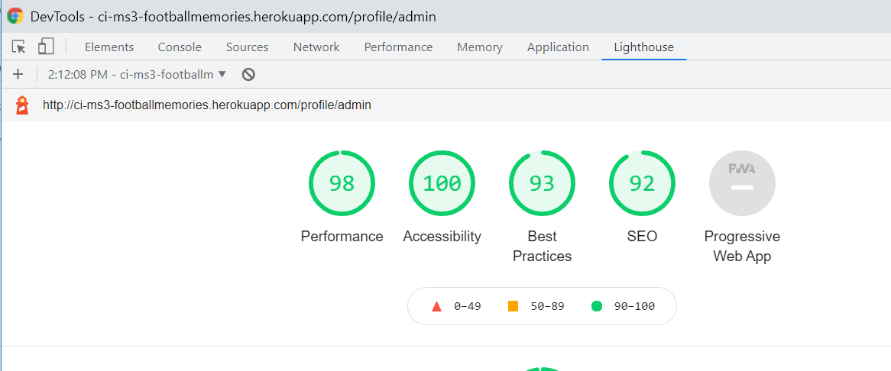

# Table of Contents
- [Testing](#testing)
  * [Manual testing information](#manual-testing-information)
  * [Feature 1 Navigation Bar](#feature-1-navigation-bar)
    + [User Story 1_1](#user-story-1-1)
    + [Test case steps 1_1](#test-case-steps-1-1)
    + [Expected Result 1_1](#expected-result-1-1)
    + [Actual Result 1_1](#actual-result-1-1)
    + [User Story 1_2](#user-story-1-2)
    + [Test case steps 1_2](#test-case-steps-1-2)
    + [Expected Result 1_2](#expected-result-1-2)
    + [Actual Result 1_2](#actual-result-1-2)
    + [User Story 1_3](#user-story-1-3)
    + [Test case steps 1_3](#test-case-steps-1-3)
    + [Expected Result 1_3](#expected-result-1-3)
    + [Actual Result 1_3](#actual-result-1-3)
    + [User Story 1_4](#user-story-1-4)
    + [Test case steps 1_4](#test-case-steps-1-4)
    + [Expected Result 1_4](#expected-result-1-4)
    + [Actual Result 1_4](#actual-result-1-4)
  * [Feature 2 Footer](#feature-2-footer)
    + [User Story 2_1](#user-story-2-1)
    + [Test case steps 2_1](#test-case-steps-2-1)
    + [Expected Result 2_1](#expected-result-2-1)
    + [Actual Result 2_1](#actual-result-2-1)
    + [User Story 2_2](#user-story-2-2)
        * [Test case steps 2_2](#test-case-steps-2-2)
    + [Expected Result 2_2](#expected-result-2-2)
    + [Actual Result 2_2](#actual-result-2-2)
    + [User Story 2_3](#user-story-2-3)
    + [Test case steps 2_3](#test-case-steps-2-3)
    + [Expected Result 2_3](#expected-result-2-3)
    + [Actual Result 2_3](#actual-result-2-3)
    + [User Story 2_4](#user-story-2-4)
    + [Test case steps 2_4](#test-case-steps-2-4)
    + [Expected Result 2_4](#expected-result-2-4)
    + [Actual Result 2_4](#actual-result-2-4)
  * [Feature 3 Landing Home page](#feature-3-landing-home-page)
    + [User Story 3_1](#user-story-3-1)
    + [Test case steps 3_1](#test-case-steps-3-1)
    + [Expected Result 3_1](#expected-result-3-1)
    + [Actual Result 3_1](#actual-result-3-1)
    + [User Story 3_2](#user-story-3-2)
    + [Test case steps 3_2](#test-case-steps-3-2)
    + [Expected Result 3_2](#expected-result-3-2)
    + [Actual Result 3_2](#actual-result-3-2)
  * [Feature 4 Login Register Logout administration](#feature-4-login-register-logout-administration)
    + [User Story 4_1](#user-story-4-1)
    + [Test case steps 4_1](#test-case-steps-4-1)
    + [Expected Result 4_1](#expected-result-4-1)
    + [Actual Result 4_1](#actual-result-4-1)
    + [User Story 4_2](#user-story-4-2)
    + [Test case steps 4_2](#test-case-steps-4-2)
    + [Expected Result 4_2](#expected-result-4-2)
    + [Actual Result 4_2](#actual-result-4-2)
    + [User Story 4_3](#user-story-4-3)
    + [Test case steps 4_3](#test-case-steps-4-3)
    + [Expected Result 4_3](#expected-result-4-3)
    + [Actual Result 4_3](#actual-result-4-3)
    + [User Story 4_4](#user-story-4-4)
    + [Test case steps 4_4](#test-case-steps-4-4)
    + [Expected Result 4_4](#expected-result-4-4)
    + [Actual Result 4_4](#actual-result-4-4)
    + [User Story 4_5](#user-story-4-5)
    + [Test case steps 4_5](#test-case-steps-4-5)
    + [Expected Result 4_5](#expected-result-4-5)
    + [Actual Result 4_5](#actual-result-4-5)
    + [User Story 4_6](#user-story-4-6)
    + [Test case steps 4_6](#test-case-steps-4-6)
    + [Expected Result 4_6](#expected-result-4-6)
    + [Actual Result 4_6](#actual-result-4-6)
    + [User Story 4_7](#user-story-4-7)
    + [Test case steps 4_7](#test-case-steps-4-7)
    + [Expected Result 4_7](#expected-result-4-7)
    + [Actual Result 4_7](#actual-result-4-7)
  * [Feature 5 Memories, Add Edit Delete Memory](#feature-5-memories--add-edit-delete-memory)
    + [User Story 5_1](#user-story-5-1)
    + [Test case steps 5_1](#test-case-steps-5-1)
    + [Expected Result 5_1](#expected-result-5-1)
    + [Actual Result 5_1](#actual-result-5-1)
    + [User Story 5_2](#user-story-5-2)
    + [Test case steps 5_2](#test-case-steps-5-2)
    + [Expected Result 5_2](#expected-result-5-2)
    + [Actual Result 5_2](#actual-result-5-2)
    + [User Story 5_3](#user-story-5-3)
    + [Test case steps 5_3](#test-case-steps-5-3)
    + [Expected Result 5_3](#expected-result-5-3)
    + [Actual Result 5_3](#actual-result-5-3)
    + [User Story 5_4](#user-story-5-4)
    + [Test case steps 5_4](#test-case-steps-5-4)
    + [Expected Result 5_4](#expected-result-5-4)
    + [Actual Result 5_4](#actual-result-5-4)
    + [User Story 5_5](#user-story-5-5)
    + [Test case steps 5_5](#test-case-steps-5-5)
    + [Expected Result 5_5](#expected-result-5-5)
    + [Actual Result 5_5](#actual-result-5-5)
    + [User Story 5_6](#user-story-5-6)
    + [Test case steps 5_6](#test-case-steps-5-6)
    + [Expected Result 5_6](#expected-result-5-6)
    + [Actual Result 5_6](#actual-result-5-6)
    + [User Story 5_7](#user-story-5-7)
    + [Test case steps 5_7](#test-case-steps-5-7)
    + [Expected Result 5_7](#expected-result-5-7)
    + [Actual Result 5_7](#actual-result-5-7)
    + [User Story 5_8](#user-story-5-8)
    + [Test case steps 5_8](#test-case-steps-5-8)
    + [Expected Result 5_8](#expected-result-5-8)
    + [Actual Result 5_8](#actual-result-5-8)
    + [User Story 5_9](#user-story-5-9)
    + [Test case steps 5_9](#test-case-steps-5-9)
    + [Expected Result 5_9](#expected-result-5-9)
    + [Actual Result 5_9](#actual-result-5-9)
    + [User Story 5_10](#user-story-5-10)
    + [Test case steps 5_10](#test-case-steps-5-10)
    + [Expected Result 5_10](#expected-result-5-10)
    + [Actual Result 5_10](#actual-result-5-10)
    + [User Story 5_11](#user-story-5-11)
    + [Test case steps 5_11](#test-case-steps-5-11)
    + [Expected Result 5_11](#expected-result-5-11)
    + [Actual Result 5_11](#actual-result-5-11)
    + [User Story 5_12](#user-story-5-12)
    + [Test case steps 5_12](#test-case-steps-5-12)
    + [Expected Result 5_12](#expected-result-5-12)
    + [Actual Result 5_12](#actual-result-5-12)
    + [User Story 5_13](#user-story-5-13)
    + [Test case steps 5_13](#test-case-steps-5-13)
    + [Expected Result 5_13](#expected-result-5-13)
    + [Actual Result 5_13](#actual-result-5-13)
  * [Feature 6 Tournaments](#feature-6-tournaments)
    + [User Story 6_1](#user-story-6-1)
    + [Test case steps 6_1](#test-case-steps-6-1)
    + [Expected Result 6_1](#expected-result-6-1)
    + [Actual Result 6_1](#actual-result-6-1)
    + [User Story 6_2](#user-story-6-2)
    + [Test case steps 6_2](#test-case-steps-6-2)
    + [Expected Result 6_2](#expected-result-6-2)
    + [Actual Result 6_2](#actual-result-6-2)
    + [User Story 6_3](#user-story-6-3)
    + [Test case steps 6_3](#test-case-steps-6-3)
    + [Expected Result 6_3](#expected-result-6-3)
    + [Actual Result 6_3](#actual-result-6-3)
    + [User Story 6_4](#user-story-6-4)
    + [Test case steps 6_4](#test-case-steps-6-4)
    + [Expected Result 6_4](#expected-result-6-4)
    + [Actual Result 6_4](#actual-result-6-4)
    + [User Story 6_5](#user-story-6-5)
    + [Test case steps 6_5](#test-case-steps-6-5)
    + [Expected Result 6_5](#expected-result-6-5)
    + [Actual Result 6_5](#actual-result-6-5)
    + [User Story 6_6](#user-story-6-6)
    + [Test case steps 6_6](#test-case-steps-6-6)
    + [Expected Result 6_6](#expected-result-6-6)
    + [Actual Result 6_6](#actual-result-6-6)
    + [User Story 6_7](#user-story-6-7)
    + [Test case steps 6_7](#test-case-steps-6-7)
    + [Expected Result 6_7](#expected-result-6-7)
    + [Actual Result 6_7](#actual-result-6-7)
  * [Feature 7 Dashboard](#feature-7-dashboard)
    + [User Story 7_1](#user-story-7-1)
    + [Test case steps 7_1](#test-case-steps-7-1)
    + [Expected Result 7_1](#expected-result-7-1)
    + [Actual Result 7_1](#actual-result-7-1)
  * [Feature 8 Profile](#feature-8-profile)
    + [User Story 8_1](#user-story-8-1)
    + [Test case steps 8_1](#test-case-steps-8-1)
    + [Expected Result 8_1](#expected-result-8-1)
    + [Actual Result 8_1](#actual-result-8-1)
    + [User Story 8_2](#user-story-8-2)
    + [Test case steps 8_2](#test-case-steps-8-2)
    + [Expected Result 8_2](#expected-result-8-2)
    + [Actual Result 8_2](#actual-result-8-2)
    + [User Story 8_3](#user-story-8-3)
    + [Test case steps 8_3](#test-case-steps-8-3)
    + [Expected Result 8_3](#expected-result-8-3)
    + [Actual Result 8_3](#actual-result-8-3)
    + [User Story 8_4](#user-story-8-4)
    + [Test case steps 8_4](#test-case-steps-8-4)
    + [Expected Result 8_4](#expected-result-8-4)
    + [Actual Result 8_4](#actual-result-8-4)
    + [User Story 8_5](#user-story-8-5)
    + [Test case steps 8_5](#test-case-steps-8-5)
    + [Expected Result 8_5](#expected-result-8-5)
    + [Actual Result 8_5](#actual-result-8-5)
- [Bugs found during the testing phase](#bugs-found-during-the-testing-phase)
- [Code Validators and Website Analysis](#code-validators-and-website-analysis)
  * [HTML Markup Validation Service](#html-markup-validation-service)
  * [CSS Validation Service](#css-validation-service)
  * [Chrome Dev tools Lighthouse](#chrome-dev-tools-lighthouse)
    + [Desktop](#desktop)
    + [Mobile](#mobile)
  * [Wave Accessibility](#wave-accessibility)
  * [JSHint](#jshint)
  * [PEP8online](#pep8online)

<small><i><a href='http://ecotrust-canada.github.io/markdown-toc/'>Table of contents generated with markdown-toc</a></i></small>

# Testing
The testing approach(described in detail in this testing readme) is as follows:
1. Manual testing using emulators and real devices
2. 
## Manual testing information
Testing was completed on the following browsers and device types

Device Number | Physical/Emulator | Device Name | Device Type | Browser | Version
------------ | ------------ | ------------- | ------------- | ------------- | -------------
1 | Physical | iPad | Tablet |  Safari | 14.4 |
2 | Physical | iPhone | Mobile |Safari | 14.4 |
3 | Physical | One Plus 5 | Mobile | Chrome | 91.0 |
4 | Physical | Windows Desktop| Desktop | IE Edge | 42.0 |
5 | Physical | Windows Desktop| Desktop | Mozilla Firefox | 85.0 |
6 | Physical | Windows Desktop| Desktop | Chrome | 91.0 |
7 | Emulator | Galaxy S5 | Mobile | Chrome Emulator | 91.0 |
8 | Emulator | iPad | Tablet | Chrome Emulator | 91.0 |
9 | Emulator | iPhone X | Mobile | Chrome Emulator | 91.0 |
10 | Emulator | iPhone 5/SE | Mobile | Chrome Emulator | 91.0 |

- Below are the test results for testing the website requirements against a range of browsers and devices
- For the purpose of the screenshots I used a Chrome emulator for desktop, tablet and mobile (Device numbers 6(Desktop), 8(Tablet), 9(Mobile))

## Feature 1 Navigation Bar
### User Story 1_1
- User Story 1.1: As an admin/regular user the navigation bar is displayed with a logo on all pages for easy navigation, with a burger menu on mobile devices

### Test case steps 1_1
1. Navigate to the home/index page

### Expected Result 1_1
1. The home/index page will be displayed with logo and navigation bar, with a burger menu on mobile devices

### Actual Result 1_1
Step Number | Desktop | Tablet | Mobile | Result 
------------ | ------------ | ------------- | ------------- | ------------- |
Step 1 | [Desktop Result](football_memories/static/images/testing/index_desktop.png)  | [Tablet Result](football_memories/static/images/testing/index_tablet.png) |[Mobile Result](football_memories/static/images/testing/index_mobile.png) | Passed |

### User Story 1_2
- User Story 1.2: As an admin/regular user the navigation item selected is highlighted

### Test case steps 1_2
1. Navigate to the Login page
1. Navigate to the Register page

### Expected Result 1_2
1. The Login page is displayed at the navigation bar link is highlighted
2. The Register page is displayed at the navigation bar link is highlighted

### Actual Result 1_2
Step Number | Desktop | Tablet | Mobile | Result 
------------ | ------------ | ------------- | ------------- | ------------- |
Step 1 | [Desktop Result](football_memories/static/images/testing/login_desktop.png)  | [Tablet Result](football_memories/static/images/testing/login_tablet.png) |[Mobile Result](football_memories/static/images/testing/login_mobile.png) | Passed |
Step 2 | [Desktop Result](football_memories/static/images/testing/register_desktop.png)  | [Tablet Result](football_memories/static/images/testing/register_tablet.png) |[Mobile Result](football_memories/static/images/testing/register_mobile.png) | Passed |

### User Story 1_3
- User Story 1.3: As an admin/regular user, when logged out, the home/landing page is the default page and there are three options with a logo, Home, Login, Register displayed

### Test case steps 1_3
1. As an admin/regular user, navigate to the home/landing page by first logging in and then logging out of the application

### Expected Result 1_3
1. The user is navigated to the  home/landing page and there are three options with a logo, Home, Login, Register displayed

### Actual Result 1_3
Step Number | Desktop | Tablet | Mobile | Result 
------------ | ------------ | ------------- | ------------- | ------------- |
Step 1 | [Desktop Result](football_memories/static/images/testing/index_desktop.png)  | [Tablet Result](football_memories/static/images/testing/index_tablet.png) |[Mobile Result](football_memories/static/images/testing/index_mobile.png) | Passed |

### User Story 1_4
- User Story 1.4: As an admin/regular user, when logged in, the memories page is the default page and there are six options with a logo: Memories, Add Memory, Tournaments, Profile, Dashboard, Logout

### Test case steps 1_4
1. As an admin/regular user login to the website

### Expected Result 1_4
1. The memories page is the default page and there are six options with a logo: Memories, Add Memory, Tournaments, Profile, Dashboard, Logout

### Actual Result 1_4
TBD

## Feature 2 Footer
### User Story 2_1
- User Story 2.1: As an admin/regular user I can view the footers social icons(Twitter, facebook, instagram, pinterest, snapchat) and the relevant website opens in a new tab when clicked
### Test case steps 2_1
1. As an admin/regular user on the home/landing page navigate to the footer and click on each social media icon

### Expected Result 2_1
1. The footer is displayed, and clicking on a social media icon opens the relevant page in a new tab

### Actual Result 2_1
TBC

### User Story 2_2
- User Story 2.2: As an admin/regular user I can view the websites terms and condition page by clicking on the link in the footer
##### Test case steps 2_2
1. As an admin/regular user click on the websites terms and condition link in the footer

### Expected Result 2_2
1. The websites terms and condition is displayed

### Actual Result 2_2
Step Number | Desktop | Tablet | Mobile | Result 
------------ | ------------ | ------------- | ------------- | ------------- |
Step 1 | [Desktop Result](football_memories/static/images/testing/terms_and_conditions_desktop.png)  | [Tablet Result](football_memories/static/images/testing/terms_and_conditions_tablet.png) |[Mobile Result](football_memories/static/images/testing/terms_and_conditions_mobile.png) | Passed |

### User Story 2_3
- User Story 2.3: As an admin/regular user I can view the websites' privacy policy page by clicking on the link in the footer
### Test case steps 2_3
1. As an admin/regular user click on the websites privacy policy link in the footer

### Expected Result 2_3
1. The websites privacy policy is displayed

### Actual Result 2_3
Step Number | Desktop | Tablet | Mobile | Result 
------------ | ------------ | ------------- | ------------- | ------------- |
Step 1 | [Desktop Result](football_memories/static/images/testing/privacy_policy_desktop.png)  | [Tablet Result](football_memories/static/images/testing/privacy_policy_tablet.png) |[Mobile Result](football_memories/static/images/testing/privacy_policy_mobile.png) | Passed |

### User Story 2_4
- User Story 2.4: As an admin/regular user I can sign up to the football memories newsletter by entering my email and clicking SignUp. The email address entered will receive an email
### Test case steps 2_4
1. As an admin/regular user navigate to the footer and enter your email address in the relevant field 
2. Click the SignUp button
3. Check your email account of the address you entered

### Expected Result 2_4
1. Your email address will be displayed in the relevant field
2. A message will be displayed: Thanks for subscribing to our mailing list
3. An email will be sent to the email address that you entered

### Actual Result 2_4
Step Number | Desktop | Tablet | Mobile | Result 
------------ | ------------ | ------------- | ------------- | ------------- |
Step 1 | [Desktop Result](football_memories/static/images/testing/newsletter1_desktop.png)  | [Tablet Result](football_memories/static/images/newsletter1_tablet.png) |[Mobile Result](football_memories/static/images/testing/newsletter1_mobile.png) | Passed |
Step 2 | [Desktop Result](football_memories/static/images/testing/newsletter2_desktop.png)  | [Tablet Result](football_memories/static/images/testing/newsletter2_tablet.png) |[Mobile Result](football_memories/static/images/testing/newsletter2_mobile.png) | Passed |
Step 3 | [Desktop Result](football_memories/static/images/testing/newsletter_email.png)  | [Tablet Result](football_memories/static/images/testing/newsletter_email.png) |[Mobile Result](football_memories/static/images/testing/newsletter_email.png) | Passed |

## Feature 3 Landing Home page
### User Story 3_1
- User Story 3.1: As a regular user/admin user I can view a hero image with login and register buttons on the home/landing page

### Test case steps 3_1
1. As a regular user/admin user navigate to the home/landing page

### Expected Result 3_1
1. The hero image with login and register buttons is displayed on the home/landing page

### Actual Result 3_1
Step Number | Desktop | Tablet | Mobile | Result 
------------ | ------------ | ------------- | ------------- | ------------- |
Step 1 | [Desktop Result](football_memories/static/images/testing/index_desktop.png)  | [Tablet Result](football_memories/static/images/testing/index_tablet.png) |[Mobile Result](football_memories/static/images/testing/index_mobile.png) | Passed |

### User Story 3_2
- User Story 3.2: As a regular user/admin user I can view the last three memories added on the website, with memory name, memory image and tournament name

### Test case steps 3_2
1. As a regular user/admin user navigate to the home/landing page and scroll down to the latest memories added section

### Expected Result 3_2
1. The last three memories added on the website, with memory name, memory image and tournament name are displayed

### Actual Result 3_2
Step Number | Desktop | Tablet | Mobile | Result 
------------ | ------------ | ------------- | ------------- | ------------- |
Step 1 | [Desktop Result](football_memories/static/images/testing/index_desktop.png)  | [Tablet Result](football_memories/static/images/testing/index_tablet.png) |[Mobile Result](football_memories/static/images/testing/index_mobile.png) | Passed |

## Feature 4 Login Register Logout administration
### User Story 4_1
- User Story 4.1: As a regular user I can register for an account by providing my username, password, confirm password, first name, last name, favourite team and country, and I will be navigated to the my memories page. All fields must be provided
### Test case steps 4_1
1. 

### Expected Result 4_1
1.

### Actual Result 4_1

### User Story 4_2
- User Story 4.2: As a regular user my username must be a minimum of 6 characters, and contain at least one lowercase letter, with no special characters
### Test case steps 4_2
1. 

### Expected Result 4_2
1.

### Actual Result 4_2

### User Story 4_3
- User Story 4.3: As a regular user my password must be a minimum of 6 characters and contain at least one number, one lowercase and one uppercase letter, with no special characters
### Test case steps 4_3
1. 

### Expected Result 4_3
1.

### Actual Result 4_3

### User Story 4_4
- User Story 4.4: As a regular user my password must match my confirm password
### Test case steps 4_4
1. As a regular user enter a password that meets the criteria and leave the confirm password field blank and click the Register button
2. As a regular user enter a confirm password that does not match the value of the password field
3. As a regular user update the confirm, password field so that it matches the password field

### Expected Result 4_4
1. The password field is highlighted in green with a "Looks good" message, and the confirm password is displayed in red with a message "Your passwords must match"
2. The password field is highlighted in green with a "Looks good" message, and the confirm password is displayed in red with a message "Your passwords must match"
3. The confirm password field is displayed in green with no error messages

### Actual Result 4_4
Step Number | Desktop | Tablet | Mobile | Result 
------------ | ------------ | ------------- | ------------- | ------------- |
Step 1 | [Desktop Result](football_memories/static/images/testing/register_desktop_4_4_1.png)  | [Tablet Result](football_memories/static/images/testing/register_tablet_4_4_1.png) |[Mobile Result](football_memories/static/images/testing/register_mobile_4_4_1.png) | Passed |
Step 2 | [Desktop Result](football_memories/static/images/testing/register_desktop_4_4_2.png)  | [Tablet Result](football_memories/static/images/testing/register_tablet_4_4_2.png) |[Mobile Result](football_memories/static/images/testing/register_mobile_4_4_2.png) | Passed |
Step 3 | [Desktop Result](football_memories/static/images/testing/register_desktop_4_4_3.png)  | [Tablet Result](football_memories/static/images/testing/register_tablet_4_4_3.png) |[Mobile Result](football_memories/static/images/testing/register_mobile_4_4_3.png) | Passed |

### User Story 4_5
- User Story 4.5: As a regular user/admin user I can log in to my account by providing my username and password and clicking Login and I will be navigated to the my memories page. A username and password must be provided. If the username and/or password entered is incorrectly a relevant message will be displayed
### Test case steps 4_5
1. 

### Expected Result 4_5
1.

### Actual Result 4_5

### User Story 4_6
- User Story 4.6: As an admin/regular user, when I am logged into the site, and I click Logout I am successfully logged out of the site, and brought to the home/landing page, and the navigation bar is updated with three options with a logo, Home, Login, Register
### Test case steps 4_6
1. 

### Expected Result 4_6
1.

### Actual Result 4_6

### User Story 4_7
- User Story 4.7: As an admin/regular user, when I am logged into the site, and I click the back button I am automatically redirected to the home/landing page, and the navigation bar is updated with three options with a logo, Home, Login, Register
### Test case steps 4_7
1. 

### Expected Result 4_7
1.

### Actual Result 4_7

## Feature 5 Memories, Add Edit Delete Memory
### User Story 5_1
- User Story 5.1: Add Memory - As a regular user/admin user I can add a memory by selecting a tournament, uploading a memory image, entering a memory name, description, date and stadium. All fields are mandatory
### Test case steps 5_1
1. 

### Expected Result 5_1
1.

### Actual Result 5_1

### User Story 5_2
- User Story 5.2: Add Memory - As a regular user/admin user the memory image I upload must be png or jpg format
### Test case steps 5_2
1. 

### Expected Result 5_2
1.

### Actual Result 5_2

### User Story 5_3
- User Story 5.3: Edit  Memory - As a regular user/admin user I can edit a memory by uploading a memory image, updating the memory name, description, date and stadium. All fields are mandatory
### Test case steps 5_3
1. 

### Expected Result 5_3
1.

### Actual Result 5_3

### User Story 5_4
- User Story 5.4: Delete Memory - As a regular user I can delete a memory I created by confirming I want to delete
### Test case steps 5_4
1. As a regular user, navigate to my memories filter on the memories page
2. Delete a memory

### Expected Result 5_4
1. The users memories are displayed and each memory has a delete button
2. A confirmation modal is displayed and once confirmed the memory is deleted

### Actual Result 5_4

### User Story 5_5
- User Story 5.5: Delete Memory - As an admin user I can delete a memory, created by any user
### Test case steps 5_5
1. As an admin user navigate to the All Memories page
2. Delete a memory

### Expected Result 5_5
1. The All Memories page is displayed and every memory will have a delete button displayed
2. A confirmation modal is displayed and once confirmed the memory is deleted

### Actual Result 5_5

### User Story 5_6
- User Story 5.6: View Memory - As a regular user/admin user I can view a memory by clicking on a memory
### Test case steps 5_6
1. As a regular user/admin navigate to the memories page
2. Click on a memory

### Expected Result 5_6
1. The memories page is displayed
2. The memory page is displayed

### Actual Result 5_6
Step Number | Desktop | Tablet | Mobile | Result 
------------ | ------------ | ------------- | ------------- | ------------- |
Step 1 | [Desktop Result](football_memories/static/images/testing/all_memories_regular_desktop.png)  | [Tablet Result](football_memories/static/images/testing/all_memories_regular_tablet.png) |[Mobile Result](football_memories/static/images/testing/all_memories_regular_mobile.png) | Passed |
Step 2 | [Desktop Result](football_memories/static/images/testing/mymemory_desktop).png)  | [Tablet Result](football_memories/static/images/testing/mymemory_tablet.png) |[Mobile Result](football_memories/static/images/testing/mymemory_mobile.png) | Passed |

### User Story 5_7
- User Story 5.7: View Memory - As a regular user/admin user I can view the memory image, stadium in a Google map, average rating, view account, memory name, description, tournament name,  date, view count, uploaded by information and all comments for the memory, and the comments area is paginated if there are more than 3 comments
### Test case steps 5_7
1. As a regular user/admin navigate to the memories page
2. Click on a memory

### Expected Result 5_7
1. The memories page is displayed
2. The memory page is displayed and the user can view the memory image, stadium in a Google map, average rating, view account, memory name, description, tournament name,  date, view count, uploaded by information and all comments for the memory, and the comments area is paginated if there are more than 3 comments

### Actual Result 5_7
Step Number | Desktop | Tablet | Mobile | Result 
------------ | ------------ | ------------- | ------------- | ------------- |
Step 1 | [Desktop Result](football_memories/static/images/testing/all_memories_regular_desktop.png)  | [Tablet Result](football_memories/static/images/testing/all_memories_regular_tablet.png) |[Mobile Result](football_memories/static/images/testing/all_memories_regular_mobile.png) | Passed |
Step 2 | [Desktop Result](football_memories/static/images/testing/all_memories_regular_comments_desktop.png)  | [Tablet Result](football_memories/static/images/testing/all_memories_regular_comments_tablet.png) |[Mobile Result](football_memories/static/images/testing/all_memories_regular_comments_mobile.png) | Passed |

### User Story 5_8
- User Story 5.8: View Memory - As a regular user/admin user the view count increases when the user clicks on a memory or refreshes the memory page
### Test case steps 5_8
1. As a regular user/admin user click on a memory and note the view count
2. As a regular user/admin user refresh the page or open the memory in a new tab 

### Expected Result 5_8
1. The view count is displayed, for this test case the view count is 46
2. The view count is increased by one to 47

### Actual Result 5_8
Step Number | Desktop | Tablet | Mobile | Result 
------------ | ------------ | ------------- | ------------- | ------------- |
Step 1 | [Desktop Result](football_memories/static/images/testing/mymemory_comments_desktop.png)  | [Tablet Result](football_memories/static/images/testing/mymemory_comments_tablet.png) |[Mobile Result](football_memories/static/images/testing/mymemory_comments_mobile.png) | Passed |
Step 2 | [Desktop Result](football_memories/static/images/testing/mymemory2_desktop.png)  | [Tablet Result](football_memories/static/images/testing/mymemory2_tablet.png) |[Mobile Result](football_memories/static/images/testing/mymemory2_mobile.png) | Passed |

### User Story 5_9
- User Story 5.9: View Memory - As a regular user/admin user I can add a comment to a memory
### Test case steps 5_9
1. As a regular user/admin user select a memory and add a comment
2. Add more than three comments to a memory

### Expected Result 5_9
1. The comment is displayed with user details, comment and date in the form MM-YYYY, latest comments are displayed first
2. Pagination is displayed if there are more than 3 comments added to a memory

### Actual Result 5_9
Step Number | Desktop | Tablet | Mobile | Result 
------------ | ------------ | ------------- | ------------- | ------------- |
Step 1 | [Desktop Result](football_memories/static/images/testing/add_comment1_desktop.png)  | [Tablet Result](football_memories/static/images/testing/add_comment1_tablet.png) |[Mobile Result](football_memories/static/images/testing/add_comment1_mobile.png) | Passed |
Step 2 | [Desktop Result](football_memories/static/images/testing/add_comment2_desktop.png)  | [Tablet Result](football_memories/static/images/testing/add_comment2_tablet.png) |[Mobile Result](football_memories/static/images/testing/add_comment2_mobile.png) | Passed |

### User Story 5_10
- User Story 5.10: View Memory - As a regular user/admin user I can add a comment to a rating to a memory, and the average rating is updated accordingly
### Test case steps 5_10
1. Click on a memory and note the average rating
2. As an admin/regular user add a rating to a memory, for example 5
2. As an admin/regular user add a rating to the same memory, for example 4

### Expected Result 5_10
1. A memory that does not have a rating will have a rating of 0
2. The average rating will update to 5
3. The average rating will update to 4.5

### Actual Result 5_10
Step Number | Desktop | Tablet | Mobile | Result 
------------ | ------------ | ------------- | ------------- | ------------- |
Step 1 | [Desktop Result](football_memories/static/images/testing/add_rating1_desktop.png)  | [Tablet Result](football_memories/static/images/testing/add_rating1_tablet.png) |[Mobile Result](football_memories/static/images/testing/add_rating1_mobile.png) | Passed |
Step 2 | [Desktop Result](football_memories/static/images/testing/add_rating2_desktop.png)  | [Tablet Result](football_memories/static/images/testing/add_rating2_tablet.png) |[Mobile Result](football_memories/static/images/testing/add_rating2_mobile.png) | Passed |
Step 3 | [Desktop Result](football_memories/static/images/testing/add_rating3_desktop.png)  | [Tablet Result](football_memories/static/images/testing/add_rating3_tablet.png) |[Mobile Result](football_memories/static/images/testing/add_rating3_mobile.png) | Passed |

### User Story 5_11
- User Story 5.11: My Memories- As a regular user/admin user I can filter on memories I have created, and the page will be paginated if there are more than 3 memories
### Test case steps 5_11
1. 

### Expected Result 5_11
1.

### Actual Result 5_11

### User Story 5_12
- User Story 5.12: All Memories - As a regular user/admin user I can filter on memories I have created, and the page will be paginated if there are more than 3 memories
### Test case steps 5_12
1. 

### Expected Result 5_12
1.

### Actual Result 5_12

### User Story 5_13
- User Story 5.13: Search - As a regular user/admin I can search on text for the memory name and memory description, and the memories page will be updated with those filtered memories 
### Test case steps 5_13
1. On the memories page, enter text for exmaple "Ireland" in the Search box and click Search

### Expected Result 5_13
1. The memories with "Ireland" in the memory text or memory description will be displayed

### Actual Result 5_13
Step Number | Desktop | Tablet | Mobile | Result 
------------ | ------------ | ------------- | ------------- | ------------- |
Step 1 | [Desktop Result](football_memories/static/images/testing/memories_search_desktop.png)  | [Tablet Result](football_memories/static/images/testing/memories_search_tablet.png) |[Mobile Result](football_memories/static/images/testing/memories_search_mobile.png) | Passed |

## Feature 6 Tournaments
### User Story 6_1
- User Story 6.1: As a regular user I can view a list of tournaments with the tournament name and tournament image displayed, and pagination is displayed if there are more than 3 tournaments
### Test case steps 6_1
1. As a regular user navigate to the tournaments page

### Expected Result 6_1
1. A list of tournaments with the tournament name and tournament image is displayed, and pagination is displayed if there are more than 3 tournaments

### Actual Result 6_1
Step Number | Desktop | Tablet | Mobile | Result 
------------ | ------------ | ------------- | ------------- | ------------- |
Step 1 | [Desktop Result](football_memories/static/images/testing/tournament_admin_desktop.png)  | [Tablet Result](football_memories/static/images/testing/tournament_admin_tablet.png) |[Mobile Result](football_memories/static/images/testing/tournament_admin_mobile.png) | Passed |

### User Story 6_2
- User Story 6.2: As an admin user I can view list of tournaments with the tournament name and tournament image displayed, and pagination is displayed if there are more than 3 tournaments. On the tournaments page I can also view an Add Tournament, Edit Tournament and Delete Tournament buttons
### Test case steps 6_2
1. As an admin user navigate to the tournaments page

### Expected Result 6_2
1. A list of tournaments with the tournament name and tournament image is displayed, and pagination is displayed if there are more than 3 tournaments. On the tournaments page the admin also view an Add Tournament, Edit Tournament and Delete Tournament buttons

### Actual Result 6_2
Step Number | Desktop | Tablet | Mobile | Result 
------------ | ------------ | ------------- | ------------- | ------------- |
Step 1 | [Desktop Result](football_memories/static/images/testing/tournament_regular_desktop.png)  | [Tablet Result](football_memories/static/images/testing/tournament_regular_tablet.png) |[Mobile Result](football_memories/static/images/testing/tournament_regular_mobile.png) | Passed |

### User Story 6_3
- User Story 6.3: As an admin user I can add a new tournament with a tournament name and tournament image. Both fields are mandatory and a message is displayed accordingly. The tournament information is added in the mongo database and the tournament image is stored in an AWS S3 bucket 
### Test case steps 6_3
1. As an admin user navigate to the tournaments page and click the Add Tournament button
2. With no fields filled in, click the Add Tournament button
3. Add a tournament name and tournament image
4. Click Add Tournament
5. Login to AWS, select S3 and bucket ci-ms3-football-memories
6. Login to Mongodb, select the MS3Cluster, select the football_memories_prod database and click on the tournaments collection

### Expected Result 6_3
1. The Add Tournament page is displayed
2. A message will be displayed to enter a tournament name and image in red around each field
3. Both fields will turn green with a "Looks Good" message displayed
4. A message will be displayed that the tournament was succesfully added and the user will be navigated to the tournaments page
5. The image will be displayed in the S3 bucket with a unique timestamp
6. The tournament will be created in the tournaments collection with tournament name and url to the location of the file in the AWS S3 bucket

### Actual Result 6_3
Step Number | Desktop | Tablet | Mobile | Result 
------------ | ------------ | ------------- | ------------- | ------------- |
Step 1 | [Desktop Result](football_memories/static/images/testing/add_tournament_blank_desktop.png)  | [Tablet Result](football_memories/static/images/testing/add_tournament_blank_tablet.png) |[Mobile Result](football_memories/static/images/testing/add_tournament_blank_mobile.png) | Passed |
Step 2 | [Desktop Result](football_memories/static/images/testing/add_tournament_error_desktop.png)  | [Tablet Result](football_memories/static/images/testing/add_tournament_error_tablet.png) |[Mobile Result](football_memories/static/images/testing/add_tournament_error_mobile.png) | Passed |
Step 3 | [Desktop Result](football_memories/static/images/testing/add_tournament_good_desktop.png)  | [Tablet Result](football_memories/static/images/testing/add_tournament_good_tablet.png) |[Mobile Result](football_memories/static/images/testing/add_tournament_good_mobile.png) | Passed |
Step 4 | [Desktop Result](football_memories/static/images/testing/add_tournament4_desktop.png)  | [Tablet Result](football_memories/static/images/testing/add_tournament4_tablet.png) |[Mobile Result](football_memories/static/images/testing/add_tournament4_mobile.png) | Passed |
Step 5 | [Desktop Result](football_memories/static/images/testing/tournament_s3_bucket.png)  | [Tablet Result](football_memories/static/images/testing/tournament_s3_bucket.png) |[Mobile Result](football_memories/static/images/testing/tournament_s3_bucket.png) | Passed |
Step 6 | [Desktop Result](football_memories/static/images/testing/tournament_mongodb.png)  | [Tablet Result](football_memories/static/images/testing/tournament_mongodb.png) |[Mobile Result](football_memories/static/images/testing/tournament_mongodb.png) | Passed |

### User Story 6_4
- User Story 6.4: As an admin user I can edit an existing tournament with a tournament name and tournament image. Both fields are mandatory and a message is displayed accordingly. The tournament information is updated in the mongo database and the tournament image is stored in an AWS S3 bucket
### Test case steps 6_4
1. 

### Expected Result 6_4
1.

### Actual Result 6_4

### User Story 6_5
- User Story 6.5: As an admin user I can delete an existing tournament, once I have confirmed that it is ok to delete the tournament. The tournament information is deleted from the mongo database
### Test case steps 6_5
1. As an admin user add a tournament, for example "Test Delete"
2. Click the delete tournament and confirm to delete the tournament "Test Delete"
3. View the tournaments page and the tournament "Test Delete" is no longer there
4. In mongodb check the tournaments collection in th database

### Expected Result 6_5
1. The tournament is added and displayed
2. The tournament is succesfully deleted
3. The tournament is no longer displayed
4. The tournament "Test Delete" is no longer in the tournaments collection in the mongodb database

### Actual Result 6_5
Step Number | Desktop | Tablet | Mobile | Result 
------------ | ------------ | ------------- | ------------- | ------------- |
Step 1 | [Desktop Result](football_memories/static/images/testing/tournaments_desktop.png)  | [Tablet Result](football_memories/static/images/testing/tournaments_tablet.png) |[Mobile Result](football_memories/static/images/testing/tournaments_mobile.png) | Passed |
Step 2 | [Desktop Result](football_memories/static/images/testing/delete_tournament1_desktop.png)  | [Tablet Result](football_memories/static/images/testing/delete_tournament1_tablet.png) |[Mobile Result](football_memories/static/images/testing/delete_tournament1_mobile.png) | Passed |
Step 3 | [Desktop Result](football_memories/static/images/testing/delete_tournament2_desktop.png)  | [Tablet Result](football_memories/static/images/testing/delete_tournament2_tablet.png) |[Mobile Result](football_memories/static/images/testing/delete_tournament2_mobile.png) | Passed |
Step 4 | [Desktop Result](football_memories/static/images/testing/delete_tournament_mongodb.PNG)  | [Tablet Result](football_memories/static/images/testing/delete_tournament_mongodb.PNG) |[Mobile Result](football_memories/static/images/testing/delete_tournament_mongodb.PNG) | Passed |

### User Story 6_6
- User Story 6.6: As an admin user if a tournament has memories associated with it, the tournament cannot be deleted and a message is displayed
### Test case steps 6_6
1. As an admin user, attempt to delete aq tournament that has memories associated with it

### Expected Result 6_6
1. The tournament will not be deleted and a message will be displayed to the user

### Actual Result 6_6
Step Number | Desktop | Tablet | Mobile | Result 
------------ | ------------ | ------------- | ------------- | ------------- |
Step 1 | [Desktop Result](football_memories/static/images/testing/delete_tournament2_desktop.png)  | [Tablet Result](football_memories/static/images/testing/delete_tournament2_tablet.png) |[Mobile Result](football_memories/static/images/testing/delete_tournament2_mobile.png) | Passed |

### User Story 6_7
- User Story 6.7: As an admin user if there is only one tournament in website, it cannot be deleted, a minimum of one tournament is required
### Test case steps 6_7
1. 

### Expected Result 6_7
1.

### Actual Result 6_7

## Feature 7 Dashboard
### User Story 7_1
- User Story 7.1: As a regular user/admin user I can view a dashboard to see the number of users, number of tournaments, number of memories, number of ratings and number of comments added on the site
### Test case steps 7_1
1. As a logged in regular user/admin user select the Dashboard link

### Expected Result 7_1
1. The dashboard displays 5 metrics: the number of users, the number of tournaments, the number of memories, the number of ratings and number of comments added on the site

### Actual Result 7_1
Step Number | Desktop | Tablet | Mobile | Result 
------------ | ------------ | ------------- | ------------- | ------------- |
Step 1 | [Desktop Result](football_memories/static/images/testing/dashboard_desktop.png)  | [Tablet Result](football_memories/static/images/testing/dashboard_tablet.png) |[Mobile Result](football_memories/static/images/testing/dashboard_mobile.png) | Passed |

## Feature 8 Profile
### User Story 8_1
- User Story 8.1: As a regular user/admin user I can view my profile details: Username, First Name, Last Name, Favourite Team and Country. The country is selected from a dropdown of countries
### Test case steps 8_1
1. As a regular user/admin click on the Profile link in the navigation bar

### Expected Result 8_1
1. The users profile is displayed with the values for username(readonly field), first name, last name, favourite team and country

### Actual Result 8_1
Step Number | Desktop | Tablet | Mobile | Result 
------------ | ------------ | ------------- | ------------- | ------------- |
Step 1 | [Desktop Result](football_memories/static/images/testing/profile_desktop.png)  | [Tablet Result](football_memories/static/images/testing/profile_tablet.png) |[Mobile Result](football_memories/static/images/testing/profile_mobile.png) | Passed |

### User Story 8_2
- User Story 8.2: As a regular user/admin user I can update my profile password, but the confirm password entered must match with the password. The password must be 8-20 characters long, contain letters and numbers, and must not contain spaces, special characters, or emoji.
### Test case steps 8_2
1. As a regular user/admin click on the Profile link in the navigation bar
2. Update the users profile, and remove some field values
3. Ensure all fields are filled in and update the favourite team from Chelsea to Manchester United
4. Click Save Changes

### Expected Result 8_2
1. The users profile is displayed with the values for username(readonly field), first name, last name, favourite team and country
2. All fields are mandatory and the confirm password entered must match with the password. The password must be 8-20 characters long, contain letters and numbers, and must not contain spaces, special characters, or emoji.
3. All fields are highlighted green
4. The users profile is updated with the favourite team value updated to Manchester United

### Actual Result 8_2
Step Number | Desktop | Tablet | Mobile | Result 
------------ | ------------ | ------------- | ------------- | ------------- |
Step 1 | [Desktop Result](football_memories/static/images/testing/profile_desktop.png)  | [Tablet Result](football_memories/static/images/testing/profile_tablet.png) |[Mobile Result](football_memories/static/images/testing/profile_mobile.png) | Passed |
Step 2 | [Desktop Result](football_memories/static/images/testing/edit_profile1_desktop.png)  | [Tablet Result](football_memories/static/images/testing/edit_profile1_desktop.png) |[Mobile Result](football_memories/static/images/testing/edit_profile1_desktop.png) | Passed |
Step 3 | [Desktop Result](football_memories/static/images/testing/edit_profile2_desktop.png)  | [Tablet Result](football_memories/static/images/testing/edit_profile2_desktop.png) |[Mobile Result](football_memories/static/images/testing/edit_profile2_desktop.png) | Passed |
Step 4 | [Desktop Result](football_memories/static/images/testing/edit_profile3_desktop.png)  | [Tablet Result](football_memories/static/images/testing/edit_profile3_desktop.png) |[Mobile Result](football_memories/static/images/testing/edit_profile3_desktop.png) | Passed |

### User Story 8_3
- User Story 8.3: As a regular user/admin user I can update my profile details: First Name, Last Name, Favourite Team and Country
### Test case steps 8_3
1. As a regular user/admin user click on the Profile page
2. Add some text to the fields First Name, Last Name, Favourite Team and Country and click "Save Changes"

### Expected Result 8_3
1. The users profile is displayed
2. The users profile is updated with the update text for the fields First Name, Last Name, Favourite Team and Country

### Actual Result 8_3
Step Number | Desktop | Tablet | Mobile | Result 
------------ | ------------ | ------------- | ------------- | ------------- |
Step 1 | [Desktop Result](football_memories/static/images/testing/edit_profile4_desktop.png)  | [Tablet Result](football_memories/static/images/testing/edit_profile4_desktop.png) |[Mobile Result](football_memories/static/images/testing/edit_profile4_desktop.png) | Passed |
Step 2 | [Desktop Result](football_memories/static/images/testing/edit_profile5_desktop.png)  | [Tablet Result](football_memories/static/images/testing/edit_profile5_desktop.png) |[Mobile Result](football_memories/static/images/testing/edit_profile5_desktop.png) | Passed |

### User Story 8_4
- User Story 8.4: As a regular user/admin user the following fields are mandatory: Username, First Name, Last Name, Favourite Team and Country
### Test case steps 8_4
1. As a regular user/admin user click on the Profile page
2. Clear the fields First Name, Last Name, Favourite Team and Country, the username is a readonly mandatory field

### Expected Result 8_4
1. The users profile is displayed
2. The fields First Name, Last Name, Favourite Team and Country are mandatory and a message is displayed and the fields are displayed in red

### Actual Result 8_4
Step Number | Desktop | Tablet | Mobile | Result 
------------ | ------------ | ------------- | ------------- | ------------- |
Step 1 | [Desktop Result](football_memories/static/images/testing/edit_profile4_desktop.png)  | [Tablet Result](football_memories/static/images/testing/edit_profile4_desktop.png) |[Mobile Result](football_memories/static/images/testing/edit_profile4_desktop.png) | Passed |
Step 2 | [Desktop Result](football_memories/static/images/testing/edit_profile6_desktop.png)  | [Tablet Result](football_memories/static/images/testing/edit_profile6_desktop.png) |[Mobile Result](football_memories/static/images/testing/edit_profile6_desktop.png) | Passed |

### User Story 8_5
- User Story 8.5: As a regular user I can delete my account. This will delete any memories I have added(including their associated comments and ratings) and will also delete any comments or ratings the regular user has added on others users memories. The user will be asked to confirm the delete account action, and will be brought to the homepage after their account is successfully deleted.
### Test case steps 8_5
1. 

### Expected Result 8_5
1.

### Actual Result 8_5

# Bugs found during the testing phase

Bug no. | Bug description |  Bug fix |
------------ | ------------- | ------------- | 
1 | When adding a memory, the memory_name was being stored as null in the memory collection| The "name" field was missing from the form field for the input type memory_name
2 | Adding a comment was throwing a 404 error | The form in memory.html file updated to send in id only, and not memory, that was not required
3 | Deleting a tournament was deleting the wrong tournament| The tournament id needed to be correctly passed down into the modal
4 | Comments not ordered by date on memory page | The fix was to sort by date <code> mongo.db.comments.find({"memory_id":  id}).sort("_id", -1) </code>
5 | When an image was added to s3, it stores the file locally also | The fix was to use the put_object boto3 method 
6 | A memory on the index/landing page was clickable, only a logged in user should be able to see the memory information | The fix was to remove the a href link 
7 | An admin should not be able to edit a users memory. Only the memory creator should be allowed to edit a memory | The fix was to update the memory route and memories template
8 | After adding a comment, the user was not routed back to the memory | Fix in add_comment(id): in route.py (memories)
9 | The email js code was sending the email to the same user, a test user.|  The fix was to update the send_email.js to update a parameter, and then update the emailjs template accordingly with a link to that field<code>"to_email": contactForm.email_address.value</code>
10 | Editing an admin user incorrectly updates the users user_type to regular_user| The fix in route.py (administration) was to get the users type first and store that when updating the users profile
11 | On profile/edit profile the field names were being overwritten by chromes autofill feature | After researching this extensively, the best solution I could implement was to update the field type from "text" to "search" (https://developer.mozilla.org/en-US/docs/Web/Security/Securing_your_site/Turning_off_form_autocompletion) and (https://stackoverflow.com/questions/12374442/chrome-ignores-autocomplete-off)

# Code Validators and Website Analysis
The website's pages was tested against the following validators:

## HTML Markup Validation Service
I used https://validator.w3.org/ to validate the html files

Page | Result | Test Detail/Screenshot
------------ | ------------- | -------------
administration/dashboard.html | Passed, No errors found | [Results](football_memories/static/images/html_validation/dashboard_html_validation.PNG)
administration/index.html | Passed, No errors found | [Results](football_memories/static/images/html_validation/index_html_validation.PNG)
administration/privacy_policy.html | Passed, No errors found | [Results](football_memories/static/images/html_validation/privacy_policy_html_validation.PNG)
administration/terms_and_conditions.html | Passed, No errors found | [Results](football_memories/static/images/html_validation/terms_and_conditions_html_validation.PNG)
authentication/login.html | Passed, No errors found | [Results](football_memories/static/images/html_validation/login_html_validation.PNG)
authentication/profile.html | Passed, No errors found | [Results](football_memories/static/images/html_validation/profile_html_validation.PNG)
authentication/register.html | Passed, No errors found | [Results](football_memories/static/images/html_validation/register_html_validation.PNG)
errors/404.html | Passed, No errors found | [Results](football_memories/static/images/html_validation/404_html_validation.PNG)
memories/add_memory.html | Passed, No errors found | [Results](football_memories/static/images/html_validation/add_memory_html_validation.PNG)
memories/edit_memory.html | Passed, No errors found | [Results](football_memories/static/images/html_validation/edit_memory_html_validation.PNG)
memories/memories.html | Passed, No errors found | [Results](football_memories/static/images/html_validation/memories_html_validation.PNG)
memories/memory.html | Passed, No errors found | [Results](football_memories/static/images/html_validation/memory_html_validation.PNG)
tournaments/add_tournament.html | Passed, No errors found | [Results](football_memories/static/images/html_validation/add_tournament_html_validation.PNG)
tournaments/edit_tournament.html | Passed, No errors found | [Results](football_memories/static/images/html_validation/edit_tournament_html_validation.PNG)
tournaments/tournaments.html | Passed, No errors found | [Results](football_memories/static/images/html_validation/tournaments_html_validation.PNG)

 

## CSS Validation Service
I used https://jigsaw.w3.org/css-validator/ to validate the css(style.css)

    

Page | Result | Test Detail/Screenshot
------------ | ------------- | -------------
style.css | Passed, No errors found | [Results](football_memories/static/images/css_validation/css_validation.PNG)

 

## Chrome Dev tools Lighthouse 

- I used Lighthouse https://developers.google.com/web/tools/lighthouse) to test the performance, seo, best practices and accessibility of the site
- Overall the results are very good. The memory pages performance is affected by the google map load times and making this load more efficient was outside of my control from a code perspective 

### Desktop
Page | Result 
------------ | ------------- 
administration/dashboard.html |  
administration/index.html  | 
administration/privacy_policy.html | 
administration/terms_and_conditions.html | 
authentication/login.html | 
authentication/profile.html | 
authentication/register.html | 
memories/add_memory.html | 
memories/edit_memory.html | 
memories/memories.html | 
memories/memory.html | 
tournaments/add_tournament.html | 
tournaments/edit_tournament.html | 
tournaments/tournaments.html | 

### Mobile
Page | Result
------------ | ------------- 
administration/dashboard.html |  
administration/index.html  | 
administration/privacy_policy.html | 
administration/terms_and_conditions.html | 
authentication/login.html | 
authentication/profile.html | 
authentication/register.html | 
memories/add_memory.html | 
memories/edit_memory.html | 
memories/memories.html | [
memories/memory.html | 
tournaments/add_tournament.html | 
tournaments/edit_tournament.html | 
tournaments/tournaments.html | 
 

## Wave Accessibility
- Wave accessibility(https://wave.webaim.org/) was used to test the websites accessibility

Page | Result | Test Detail/Screenshot
------------ | ------------- | -------------
football_memories/templates/administration/dashboard.html | 0 errors and 0 contrast errors| [Results](football_memories/static/images/wave_validation/wave_dashboard.PNG)
football_memories/templates/administration/index.html  | 0 errors and 0 contrast errors| [Results](football_memories/static/images/wave_validation/wave_landing.PNG)
football_memories/templates/administration/privacy_policy.html  | 0 errors and 0 contrast errors| [Results](football_memories/static/images/wave_validation/wave_dashboard.PNG)
football_memories/templates/administration/terms_and_conditions.html  | 0 errors and 0 contrast errors| [Results](football_memories/static/images/wave_validation/wave_terms_and_conditions.PNG)
football_memories/templates/authentication/login.html | 0 errors and 0 contrast errors| [Results](football_memories/static/images/wave_validation/wave_login.PNG)
football_memories/templates/authentication/profile.html | 0 errors and 0 contrast errors| [Results](football_memories/static/images/wave_validation/wave_profile.PNG)
football_memories/templates/authentication/register.html | 0 errors and 0 contrast errors| [Results](football_memories/static/images/wave_validation/wave_register.PNG)
football_memories/templates/errors/404.html | 0 errors and 0 contrast errors| [Results](football_memories/static/images/wave_validation/wave_404.PNG)
football_memories/templates/memories/add_memory.html | 0 errors and 0 contrast errors| [Results](football_memories/static/images/wave_validation/wave_add_memory.PNG)
football_memories/templates/memories/edit_memory.html | 0 errors and 0 contrast errors| [Results](football_memories/static/images/wave_validation/wave_edit_memory.PNG)
football_memories/templates/memories/memories.html | 0 errors and 0 contrast errors| [Results](football_memories/static/images/wave_validation/wave_memories.PNG)
football_memories/templates/memories/memory.html | 10 errors and 0 contrast errors (Note: These are within the google map so I cannot update/fix as they are outside of my control)| [Results](football_memories/static/images/wave_validation/wave_memory.PNG)
football_memories/templates/tournaments/add_tournament.html | 0 errors and 0 contrast errors| [Results](football_memories/static/images/wave_validation/wave_add_tournament.PNG)
football_memories/templates/tournaments/edit_tournament.html | 0 errors and 0 contrast errors| [Results](football_memories/static/images/wave_validation/wave_edit_tournament.PNG)
football_memories/templates/tournaments/tournament.html | 0 errors and 0 contrast errors| [Results](football_memories/static/images/wave_validation/wave_tournaments.PNG)

## JSHint
- JSHint was used to analyse the Javascript files

Page | Result | Test Detail/Screenshot
------------ | ------------- | -------------
authentication.js | 0 errors and 0 warnings | [Results](football_memories/static/images/jshint/authentication.PNG)
memory.js | 0 errors and 0 warnings | [Results](football_memories/static/images/jshint/memory.PNG)
send_email.js | 0 errors and 0 warnings | [Results](football_memories/static/images/jshint/send_email.PNG)

 

## PEP8online
- PEP8online was used to analyse the Python files (https://pep8online.com/)

Page | Result | Test Detail/Screenshot
------------ | ------------- | -------------
app.py | No errors/warnings | [Results](football_memories/static/images/pep8/app.PNG)
football_memories/__ init __.py | No errors/warnings | [Results](football_memories/static/images/pep8/init.PNG)
football_memories/administration/routes.py | No errors/warnings | [Results](football_memories/static/images/pep8/administration_route.PNG)
football_memories/authentication/routes.py | No errors/warnings | [Results](football_memories/static/images/pep8/authentication_route.PNG)
football_memories/errors/routes.py | No errors/warnings | [Results](football_memories/static/images/pep8/errors_route.PNG)
football_memories/memories/routes.py | No errors/warnings | [Results](football_memories/static/images/pep8/memories_route.PNG)
football_memories/tournaments/routes.py | No errors/warnings | [Results](football_memories/static/images/pep8/tournaments_route.PNG)